<!-- markdownlint-disable MD033 MD041 MD034 MD013 MD024 -->

<div align="center">

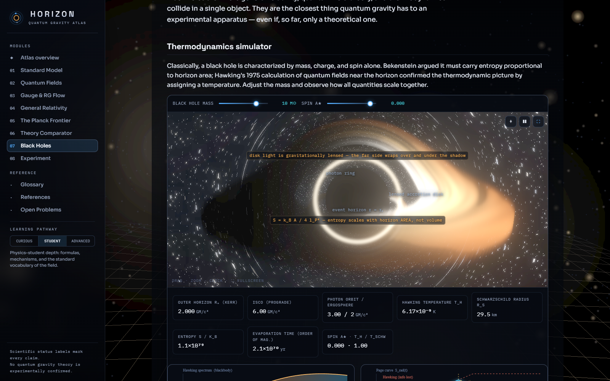

<br/><br/>

<p>
  <a href="https://mustafaras.github.io/horizon-quantum-gravity-atlas/"></a>
  <a href="https://github.com/mustafaras/horizon-quantum-gravity-atlas/actions/workflows/quality.yml"></a>
  <a href="#run-locally"></a>
  <a href="#technical-architecture"></a>
  <a href="#scientific-status-system"></a>
  <a href="#license"></a>
</p>

<p>
  
  
  
  
  
  
  
</p>

<h1 align="center">HORIZON — Quantum Gravity Atlas</h1>

<h3 align="center">A cinematic, equation-aware, scientifically cautious atlas of the road from quantum fields to dynamical spacetime.</h3>

<p align="center">
  <strong>
    Standard Model · Quantum Field Theory · Gauge Symmetry · Renormalization · General Relativity · Planck Scale ·
    Quantum Gravity Programs · Black Holes · Holography · Collider and Gravitational-Wave Constraints
  </strong>
</p>

<p align="center">
  <a href="#visual-atlas">Visual Atlas</a>
  ·
  <a href="#social-preview-and-install-metadata">Social Preview</a>
  ·
  <a href="#scientific-thesis">Scientific Thesis</a>
  ·
  <a href="#scientific-validity-matrix">Validity Matrix</a>
  ·
  <a href="#architecture-preview">Architecture Preview</a>
  ·
  <a href="#mathematical-formulations">Mathematical Formulations</a>
  ·
  <a href="#static-diagram-pack">Static Diagram Pack</a>
  ·
  <a href="#run-locally">Run Locally</a>
  ·
  <a href="#references">References</a>
</p>

</div>

---

## Scientific Position

**HORIZON** is not a claim that quantum gravity has been solved.

It is an interactive map of why the problem exists.

It starts from experimentally established physics.

It moves through the formal machinery of quantum field theory and general relativity.

It shows where those frameworks conflict.

It then compares the major research programs without declaring a winner.

The central rule of the project is simple:

> A visualization may be cinematic, but the epistemic status of the physics must remain explicit.

No complete theory of quantum gravity is experimentally confirmed.

Hawking radiation is theoretically compelling but not directly observed.

String theory, loop quantum gravity, asymptotic safety, causal sets, and holography are serious research programs, not established descriptions of nature.

Black holes are used as theoretical laboratories, not as solved experimental apparatuses.

The app therefore labels claims as **established physics**, **effective theory**, **schematic model**, **conjectural framework**, or **open problem**.

---

## Live Access

GitHub Pages:

```text
https://mustafaras.github.io/horizon-quantum-gravity-atlas/
```

Repository-local app:

```text
http://127.0.0.1:8000/
```

The current repository is static-first.

It can run from a plain local HTTP server.

It does not require a backend.

It does not require a build step.

It loads React, Babel, Three.js, and KaTeX from CDN URLs declared in `index.html`.

---

## Social Preview and Install Metadata

<p align="center">
  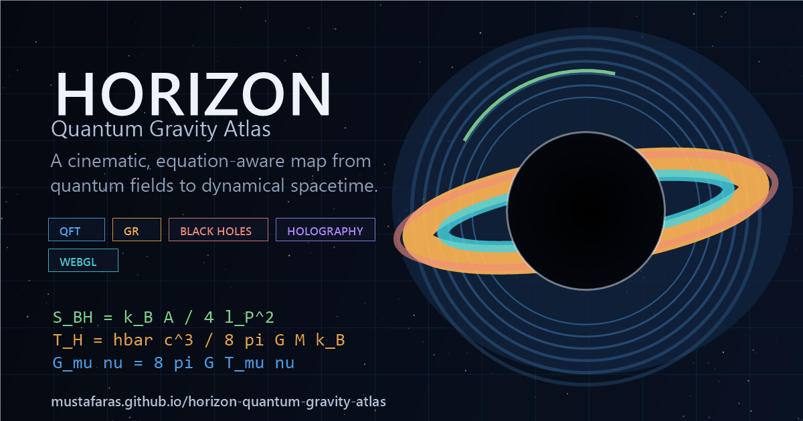
</p>

The repository includes a dedicated Open Graph image for GitHub, LinkedIn, X, Discord, and other social previews.

The app also includes a web manifest and install icons, so browser surfaces can present it as a polished standalone scientific atlas instead of a raw static page.

| Asset | Purpose |
|---|---|
| `docs/social/og-image.png` | 1200x630 social sharing preview |
| `manifest.webmanifest` | install metadata, theme color, app scope, and icon registry |
| `docs/icons/icon-192.png` | Android and PWA launcher icon |
| `docs/icons/icon-512.png` | high-resolution launcher and maskable icon |
| `docs/icons/apple-touch-icon.png` | iOS home-screen icon |
| `docs/icons/favicon-16.png` / `docs/icons/favicon-32.png` | PNG fallbacks for browsers that do not prefer the SVG favicon |

---

## Visual Atlas

All screenshots below were captured from the running application, not from static mockups.

The screenshot set intentionally functions as a cinematic gallery: each frame should show a scientific visualization, an active module state, and a meaningful physical interpretation.

Black-hole screenshots are included prominently because the black-hole module is the strongest visual bridge between general relativity, quantum field theory, thermodynamics, entropy, and holography.

<table>
<tr>
<td width="50%">

<br/>
<sub><strong>Black-hole Kerr laboratory</strong> — raymarched accretion disk, photon ring, horizon readouts, entropy and temperature scaling.</sub>
</td>
<td width="50%">
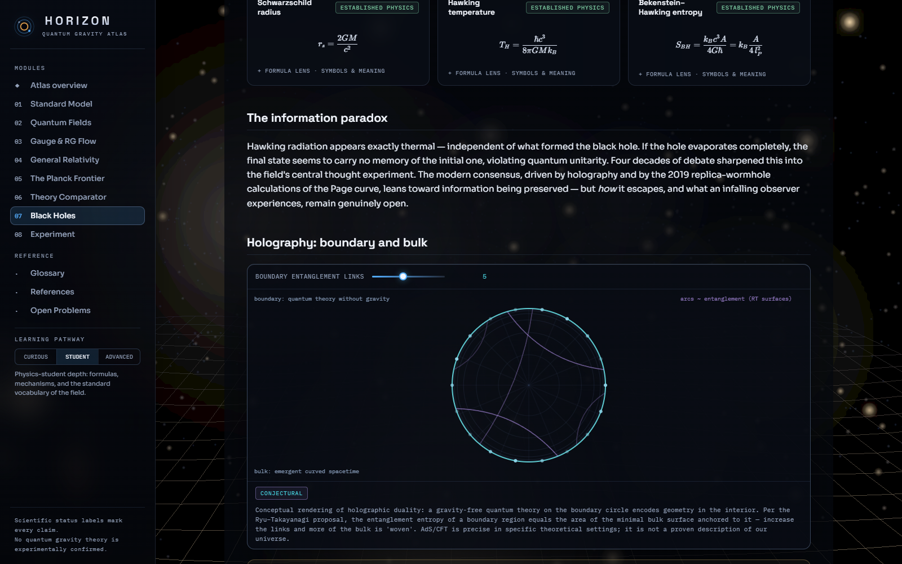
<br/>
<sub><strong>Holography: boundary and bulk</strong> — boundary entanglement arcs as a conceptual rendering of holographic duality.</sub>
</td>
</tr>
<tr>
<td width="50%">
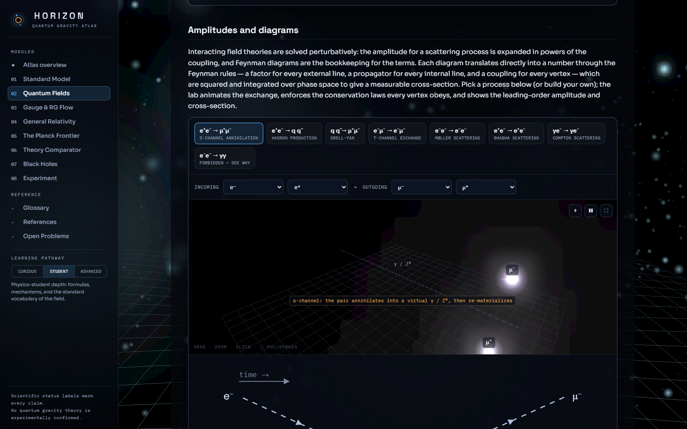
<br/>
<sub><strong>QFT collision laboratory</strong> — animated scattering process with exchanged virtual carrier and matching Feynman diagram.</sub>
</td>
<td width="50%">
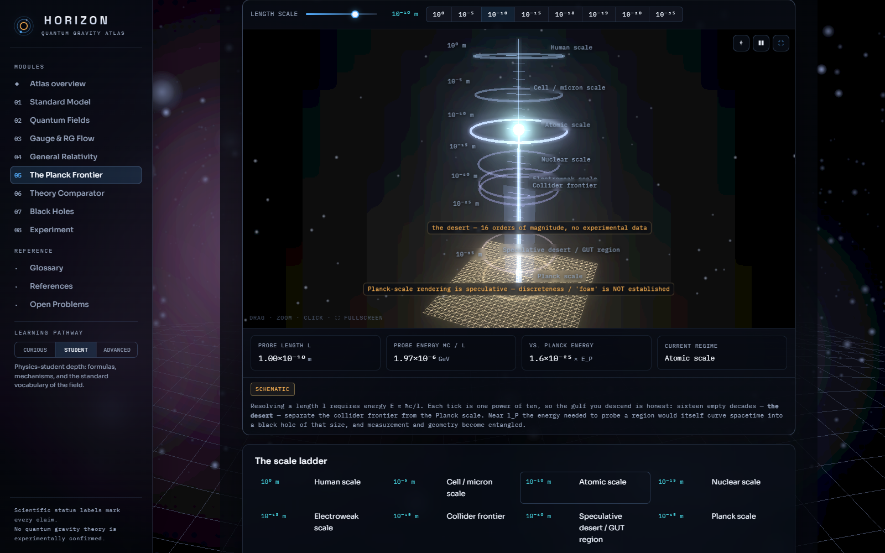
<br/>
<sub><strong>Planck frontier</strong> — logarithmic descent from human scale to the speculative Planck regime and the experimental desert.</sub>
</td>
</tr>
<tr>
<td width="50%">
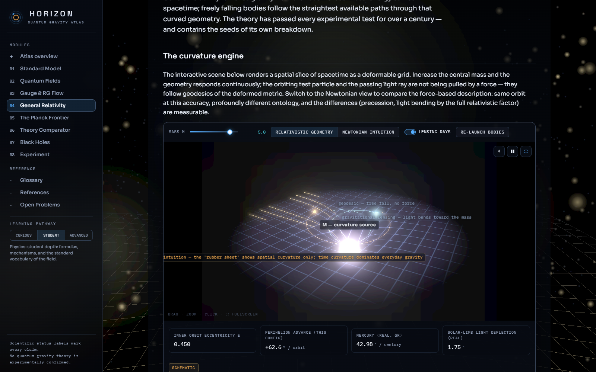
<br/>
<sub><strong>Curvature engine</strong> — deformable spacetime slice, geodesic motion, perihelion advance, and gravitational lensing rays.</sub>
</td>
<td width="50%">
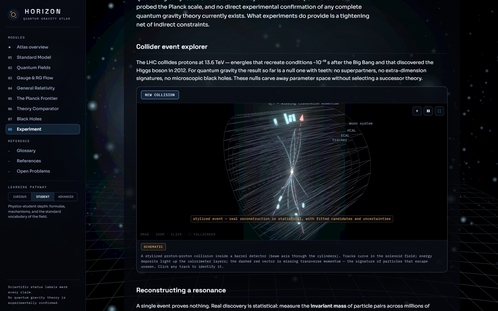
<br/>
<sub><strong>Collider event display</strong> — stylized detector barrel, charged tracks, calorimeter deposits, and missing transverse momentum.</sub>
</td>
</tr>
<tr>
<td width="50%">
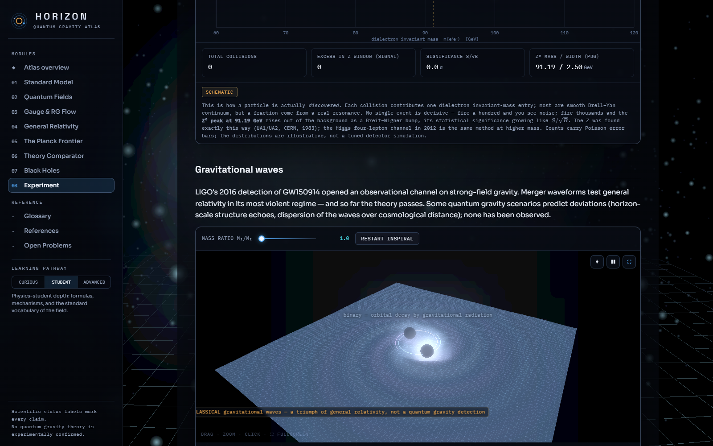
<br/>
<sub><strong>Gravitational waves</strong> — binary inspiral, orbital decay, spacetime ripple, and strain interpretation.</sub>
</td>
<td width="50%">
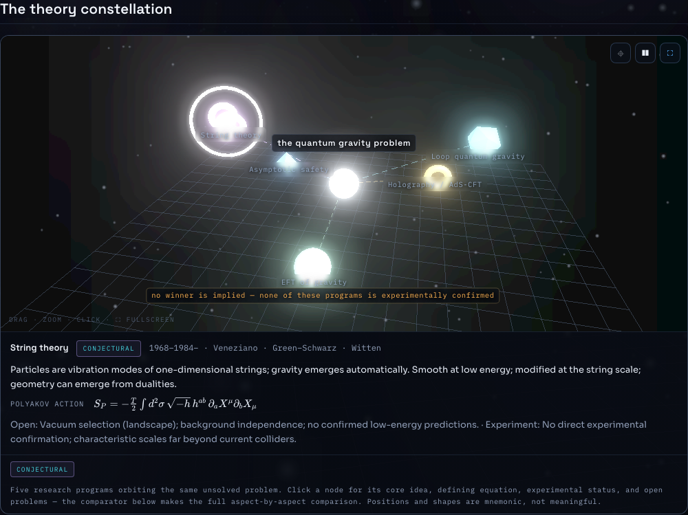
<br/>
<sub><strong>Theory constellation</strong> — string theory, loop quantum gravity, asymptotic safety, EFT gravity, and holography orbiting the same unresolved problem.</sub>
</td>
</tr>
<tr>
<td width="50%">
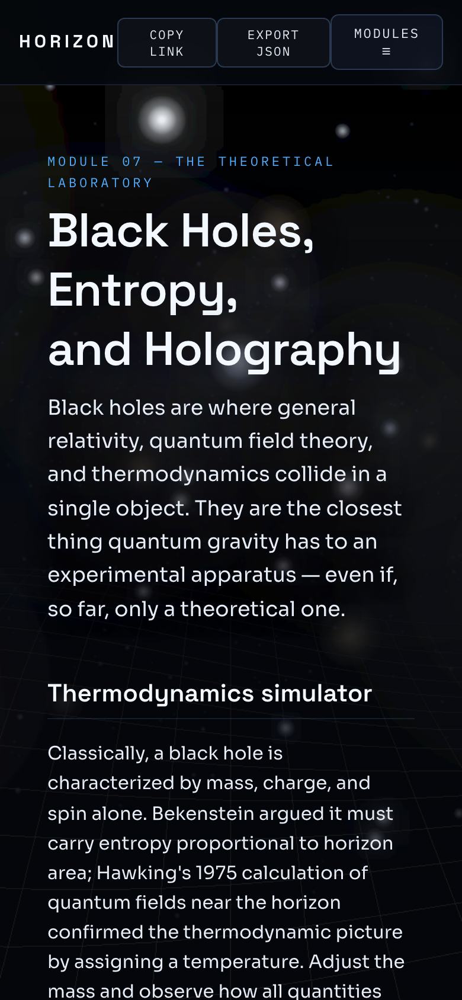
<br/>
<sub><strong>Mobile black-hole laboratory</strong> — responsive module layout with the black-hole scene preserved on a narrow viewport.</sub>
</td>
<td width="50%">
<strong>Screenshot policy</strong>
<br/><br/>
Every README visual must be reproducible from a real app state.
<br/><br/>
No stock imagery.
<br/><br/>
No decorative-only hero art.
<br/><br/>
No screenshot should imply that conjectural physics is experimentally observed.
</td>
</tr>
<tr>
<td width="50%">
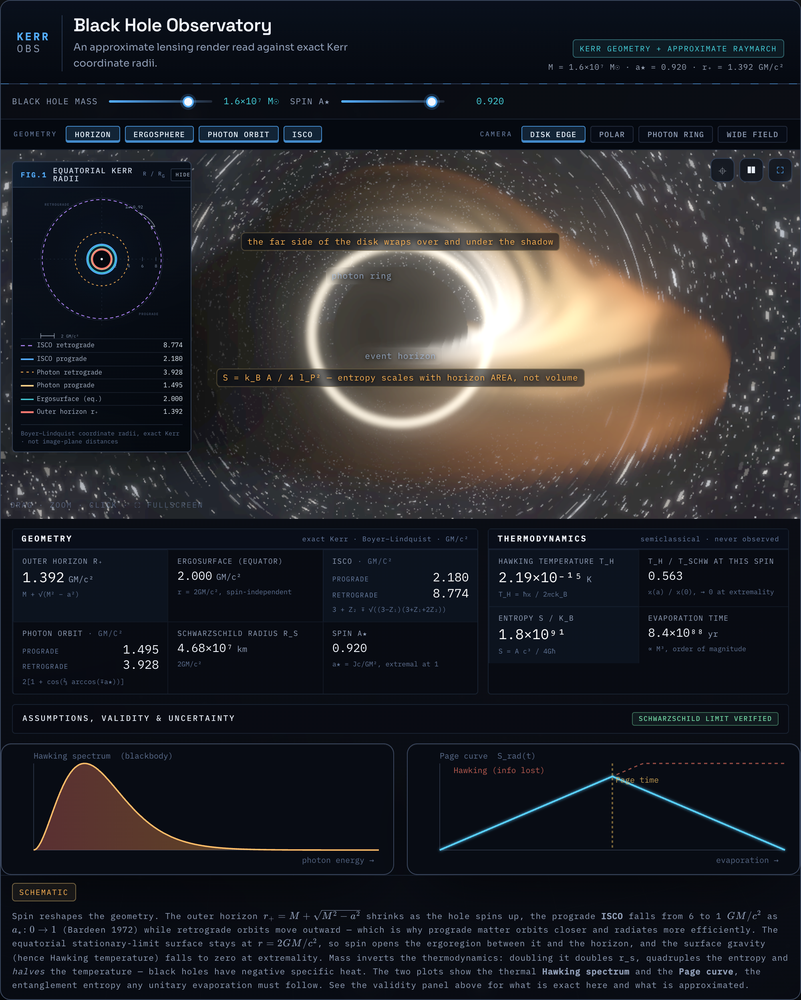
<br/>
<sub><strong>Kerr geometry observatory</strong> — live high-spin view with horizon, equatorial ergosphere, prograde/retrograde photon-orbit and ISCO layers. The map uses Kerr coordinate radii; the image remains an explicitly approximate raymarch.</sub>
</td>
<td width="50%">

<br/>
<sub><strong>Mobile geometry instrument</strong> — the exact-coordinate radii map starts collapsed on small screens and remains available from a compact in-scene control, preserving the lensing view without discarding scientific context.</sub>
</td>
</tr>
<tr>
<td width="50%">
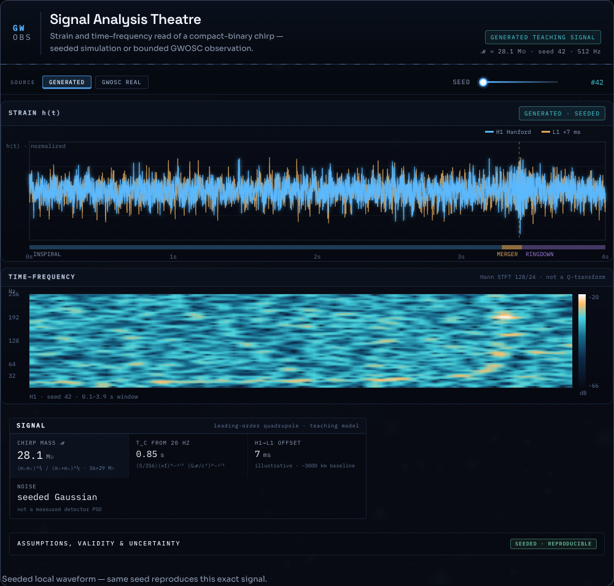
<br/>
<sub><strong>GW signal analysis theatre</strong> — seeded dual-detector chirp with animated playback: a transport bar (play/pause, replay, 0.5–4× speed) sweeps a playhead across both instruments, the strain reveals progressively with a merger flash at coalescence, and the Hann-STFT spectrogram overlays the exact leading-order frequency track. Drag the playhead or any trace to scrub; hover for a live t·h·f crosshair readout; component masses and seed are slider-controlled and URL-encoded.</sub>
</td>
<td width="50%">
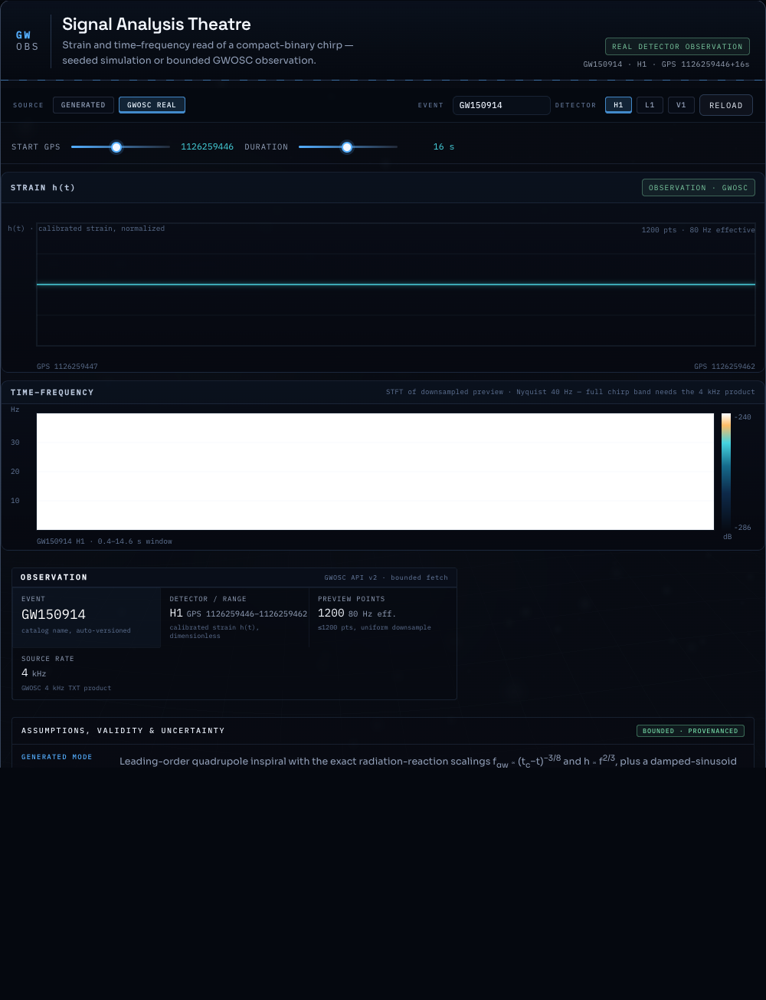
<br/>
<sub><strong>Real observation mode</strong> — bounded GWOSC API v2 calibrated strain (GW150914·H1 preview) with GPS axis, provenance links, and an explicit effective-rate Nyquist limit for the downsampled preview.</sub>
</td>
</tr>
<tr>
<td width="50%">

<br/>
<sub><strong>Mobile analysis theatre</strong> — transport, strain, and time–frequency panels stack without horizontal overflow; playback, scrubbing, and the seeded simulation remain fully usable offline.</sub>
</td>
<td width="50%">
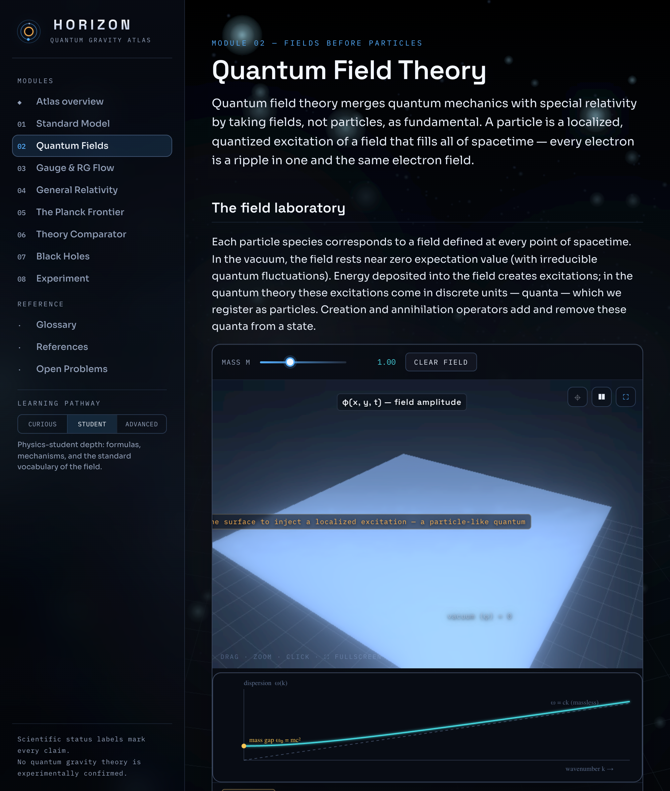
<br/>
<sub><strong>QFT amplitude room</strong> — a live 2 → 2 scattering bench. The Mandelstam variables, the angular distribution, the photon 1/s cross-section, and the Z⁰ Breit–Wigner shape are evaluated from the pure physics functions on every frame; the transport bar scrubs a normalised collision phase, and the identity residual is shown rather than hidden.</sub>
</td>
</tr>
<tr>
<td width="50%">
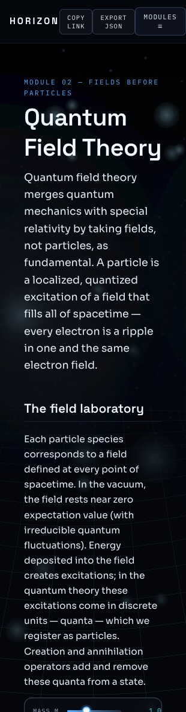
<br/>
<sub><strong>Mobile amplitude room</strong> — the four instrument panels stack into a single column and the control rows expand to full width, with no horizontal overflow.</sub>
</td>
<td width="50%"></td>
</tr>
</table>

---

## Scientific Thesis

Quantum gravity is not a single missing equation.

It is a collision between two extraordinarily successful frameworks.

Quantum field theory assumes fields defined on a spacetime background.

General relativity says the spacetime background is itself dynamical.

This tension is not only philosophical.

It becomes quantitative the moment one tries to perturbatively quantize the Einstein-Hilbert action.

Newton's constant has negative mass dimension in four spacetime dimensions.

Consequently the effective strength of gravity grows with energy as a power law rather than logarithmically.

At low energies, gravity is a perfectly valid quantum effective field theory.

Near the Planck scale, the perturbative expansion loses predictive power.

Black holes then sharpen the issue.

They combine horizons, thermodynamics, quantum fields in curved spacetime, entropy-area scaling, and information flow.

Any credible quantum-gravity program must explain why black holes carry entropy proportional to area and how unitary quantum evolution is reconciled with semiclassical evaporation.

HORIZON exists to make that chain of reasoning visible.

---

## Design Principles

### 1. Scientific Honesty Before Visual Drama

The app uses cinematic visuals.

It does not use cinematic certainty.

Every major panel distinguishes observed physics from models, approximations, and conjectures.

### 2. Equations Are Interface Objects

Equations are not decorative glyphs.

Each equation is paired with symbol definitions, meaning, and limitations.

The interface treats a formula as a compact map of assumptions.

### 3. Interactivity Carries Interpretation

Sliders are not merely UI ornaments.

A mass slider changes the black-hole radius, temperature, entropy, evaporation time, and Kerr geometry readouts.

A scale slider shows how many decades separate collider physics from the Planck length.

A collision selector changes both a 3D scattering animation and the matching diagrammatic amplitude.

### 4. Aesthetic Density Must Not Hide Epistemic Boundaries

Dark scientific atmosphere, bloom, raymarched scenes, grids, and labels create an instrument-like tone.

But the strongest visual panels also carry caveats.

The Planck foam is labeled speculative.

The collider display is labeled schematic.

The holography panel is labeled conjectural.

### 5. Static Deployment, Research-Grade Presentation

The project is intentionally easy to host.

It remains a folder of static files.

Yet the README presents it as a long-form scientific artifact, not only as a web demo.

---

## Architecture Preview

<p align="center">
  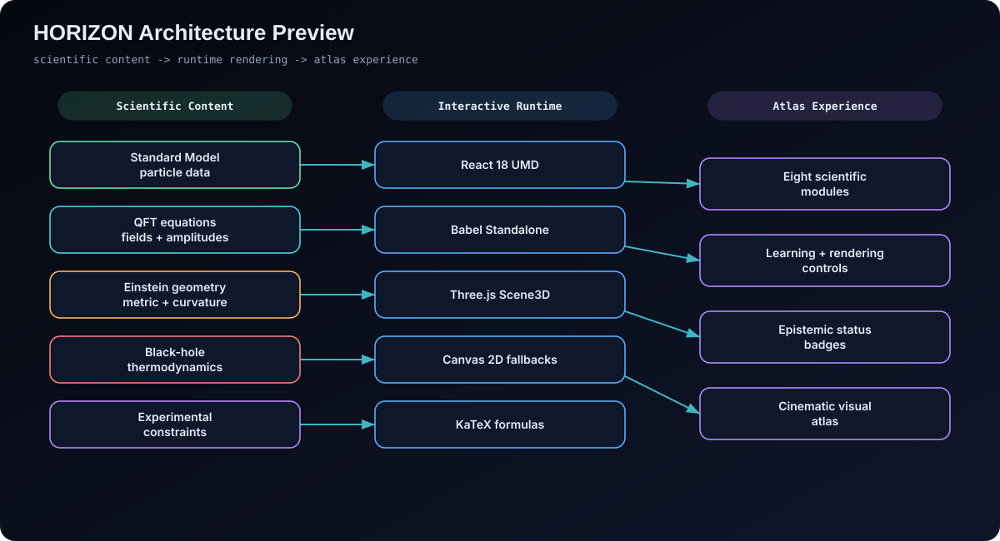
</p>

<p align="center">
  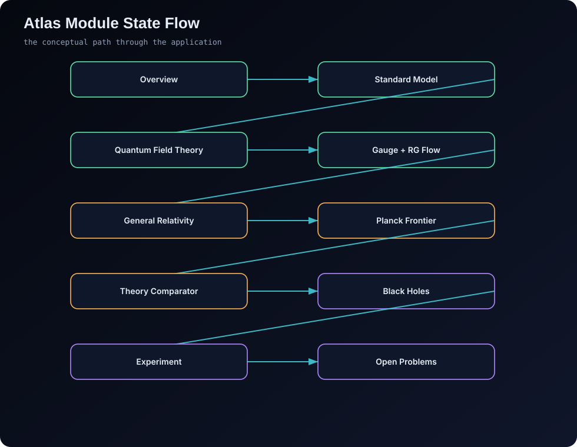
</p>

<p align="center">
  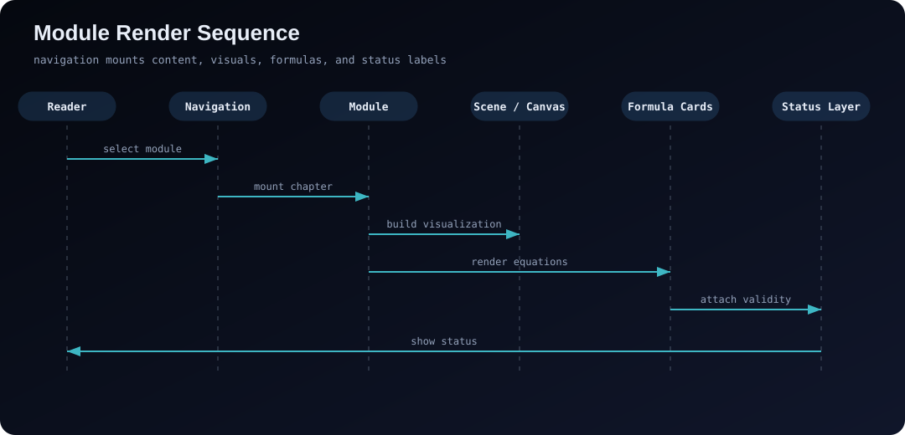
</p>

---

## Module Matrix

| # | Module | Core scientific role | Visual system | Epistemic emphasis |
|---|---|---|---|---|
| 01 | Standard Model | Particle content and gauge architecture | 3D particle map and analytical atlas | established physics with known gaps |
| 02 | Quantum Field Theory | Fields, quanta, amplitudes, propagators | Klein-Gordon membrane and Feynman collision lab | established formalism with pedagogical simplification |
| 03 | Gauge Symmetry & RG Flow | Local symmetry and scale dependence | RG landscape and running coupling simulator | established one-loop logic with domain limits |
| 04 | General Relativity | Gravity as curved spacetime | deformable geometry, geodesics, lensing rays | established classical theory |
| 05 | Planck Frontier | Why perturbative quantum gravity fails | scale ladder and speculative foam visualization | established obstruction, speculative visualization |
| 06 | Theory Comparator | Candidate quantum-gravity programs | 3D theory constellation and comparator | conjectural frameworks |
| 07 | Black Holes | Entropy, horizons, Hawking radiation, holography | raymarched black hole, Page curve, holography | semiclassical landmarks and open paradoxes |
| 08 | Experiment | Collider, gravitational-wave, cosmological constraints | detector event, resonance histogram, binary inspiral | indirect constraints and null results |

---

## Scientific Status System

<p align="center">
  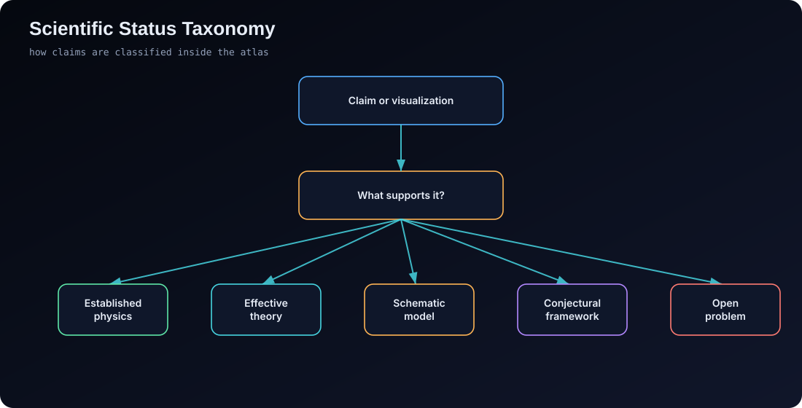
</p>

### Label Semantics

| Label | Meaning | Examples in HORIZON |
|---|---|---|
| Established physics | experimentally tested or standard within accepted theory | Standard Model fields, Einstein field equations, gravitational waves |
| Effective theory | valid in a controlled regime below a cutoff | low-energy quantum gravity EFT |
| Schematic | visual or pedagogical model, not a literal observation | spacetime grid, collider event display, Planck foam rendering |
| Conjectural | researched but not experimentally confirmed | string theory, LQG, asymptotic safety, holographic universality |
| Open problem | unresolved conceptual or empirical issue | information paradox, cosmological constant, problem of time |

---

## Scientific Validity Matrix

This matrix separates what the app visualizes from what physics currently justifies.

It is deliberately conservative: strong visuals are not allowed to upgrade the epistemic status of a claim.

| Module | Primary visual surface | Highest status used | Scientific guardrail |
|---|---|---|---|
| Standard Model | particle architecture and interaction map | Established physics | gravity is explicitly outside the Standard Model gauge group |
| Quantum Field Theory | field excitation and scattering laboratory | Established / Effective theory | diagrams are perturbative terms, not literal particle movies |
| Gauge Symmetry and RG Flow | local symmetry and running couplings | Established / Effective theory | coupling evolution is contextualized by scale and scheme |
| General Relativity | curvature, geodesics, lensing, gravitational waves | Established physics | rubber-sheet scenes are spatial slices, not full spacetime |
| Planck Frontier | scale ladder and Planck foam rendering | Schematic / Open problem | Planck-scale structure is not presented as observed |
| Theory Comparator | string theory, LQG, asymptotic safety, EFT, holography | Conjectural / Effective theory | no candidate program is ranked as experimentally confirmed |
| Black Holes | horizon, accretion, entropy, temperature, Page curve | Established / Effective / Open problem | raymarching is cinematic, while Hawking radiation remains unobserved |
| Experiment | collider events, gravitational waves, cosmological constraints | Established physics / Constraint | experiments constrain models; they do not detect quantum gravity directly |

---

## Mathematical Formulations

This section summarizes the key scientific equations carried by the app.

The goal is not to derive a full textbook.

The goal is to show the mathematical spine that connects the modules.

### 1. Standard Model Gauge Structure

The Standard Model is organized by a gauge group:

```math
SU(3)_C \times SU(2)_L \times U(1)_Y
```

The three factors correspond to color, weak isospin, and hypercharge.

Electric charge emerges after electroweak symmetry breaking:

```math
Q = T_3 + \frac{Y}{2}
```

The covariant derivative packages the gauge interactions:

```math
D_\mu = \partial_\mu
       + i g_s G_\mu^a T^a
       + i g W_\mu^i \tau^i
       + i g' Y B_\mu
```

The Higgs potential is:

```math
V(\Phi) = \mu^2 \Phi^\dagger \Phi + \lambda(\Phi^\dagger \Phi)^2
```

For $\mu^2 < 0$, the field acquires a nonzero vacuum expectation value:

```math
v = \sqrt{-\mu^2/\lambda} \approx 246\,\mathrm{GeV}
```

This gives masses to the $W^\pm$ and $Z^0$ bosons and to fermions through Yukawa couplings.

**Limit:** the minimal Standard Model does not include gravity.

**Limit:** neutrino masses require additional structure.

**Limit:** the hierarchy problem remains unresolved.

### 2. Quantum Field Theory and the Path Integral

Quantum field theory treats particles as excitations of fields.

A transition amplitude can be formally expressed as:

```math
\mathcal{A}_{i\to f}
= \int \mathcal{D}\phi \,
e^{iS[\phi]/\hbar}
```

The action for a real scalar field is:

```math
S = \int d^4x \,
\left[
\frac{1}{2}\partial_\mu\phi\,\partial^\mu\phi
- \frac{1}{2}m^2\phi^2
- V(\phi)
\right]
```

The Klein-Gordon equation is:

```math
(\Box + m^2)\phi = 0
```

Its dispersion relation is:

```math
\omega^2 = c^2 k^2 + \frac{m^2 c^4}{\hbar^2}
```

The mass gap appears as a nonzero frequency at zero spatial wavenumber.

The Feynman propagator for a scalar field is:

```math
\Delta_F(p) = \frac{i}{p^2 - m^2 + i\epsilon}
```

For $2\to2$ scattering, the Mandelstam invariants are:

```math
s = (p_1+p_2)^2
```

```math
t = (p_1-p_3)^2
```

```math
u = (p_1-p_4)^2
```

For the example process $e^+e^- \to \mu^+\mu^-$, the leading high-energy scaling is:

```math
\sigma(e^+e^- \to \mu^+\mu^-)
\sim
\frac{4\pi\alpha^2}{3s}
```

Near the $Z^0$ pole, a Breit-Wigner resonance modifies the cross-section:

```math
\sigma(s) \propto
\frac{\Gamma_{\mathrm{in}}\Gamma_{\mathrm{out}}}
{(s-M_Z^2)^2 + M_Z^2\Gamma_Z^2}
```

The Mandelstam identity is exact for any $2\to2$ process:

```math
s + t + u = \sum_i m_i^2
```

Compton scattering follows the Klein-Nishina differential cross-section:

```math
\frac{d\sigma}{d\Omega}
= \frac{\alpha^2}{2m_e^2}
\left(\frac{E'}{E}\right)^{2}
\left[
\frac{E'}{E} + \frac{E}{E'} - \sin^2\theta
\right]
```

The **Amplitude Room** in the app evaluates these relations live. It reports $s$, $t$, $u$, the residual of the Mandelstam identity, $\sigma = 4\pi\alpha^2/3s$, the Breit-Wigner value, and the normalised angular shape for the selected process. The residual is displayed as floating-point noise rather than being hidden, so the identity can be checked on screen.

**Limit:** Feynman diagrams are terms in a perturbative expansion.

**Limit:** virtual particles are calculational structures, not directly observed objects.

**Limit:** the path integral measure is formal except in special rigorously defined cases.

**Limit:** the t-channel curve shows only the leading pole $1/\sin^4(\theta/2)$. The full Møller and Bhabha amplitudes also contain $s$- and $u$-channel terms and their interference, which the app does not draw.

**Limit:** the $Z^0$ panel shows the Breit-Wigner shape alone, not the $\gamma$–$Z^0$ interference term.

**Limit:** the scattering-plane and spacetime canvases are schematic animations, not solutions of the QED amplitude.

### 3. Gauge Symmetry and Renormalization

Gauge invariance promotes global symmetry to local symmetry.

The Yang-Mills field strength is:

```math
F_{\mu\nu}^a =
\partial_\mu A_\nu^a
- \partial_\nu A_\mu^a
+ g f^{abc} A_\mu^b A_\nu^c
```

The non-Abelian term produces gauge-boson self-interactions.

At one loop, a generic coupling runs as:

```math
\mu\frac{dg}{d\mu}
= \beta(g)
= -\frac{b_0}{16\pi^2}g^3 + \mathcal{O}(g^5)
```

For QCD with sufficiently few flavors, $b_0>0$, and the coupling weakens at high energy.

This is asymptotic freedom.

Gravity differs because Newton's constant has mass dimension $-2$ in four dimensions:

```math
[G_N] = -2
```

The dimensionless strength grows with energy:

```math
\alpha_{\mathrm{grav}}(E)
\sim
\frac{G_N E^2}{\hbar c^5}
=
\left(\frac{E}{E_P}\right)^2
```

This scaling is one of the simplest ways to see why the Planck scale is special.

### 4. General Relativity

Einstein's field equations are:

```math
G_{\mu\nu} + \Lambda g_{\mu\nu}
=
\frac{8\pi G}{c^4}T_{\mu\nu}
```

where:

```math
G_{\mu\nu}
=
R_{\mu\nu}
- \frac{1}{2}R g_{\mu\nu}
```

The geodesic equation is:

```math
\frac{d^2x^\mu}{d\tau^2}
+ \Gamma^\mu_{\alpha\beta}
\frac{dx^\alpha}{d\tau}
\frac{dx^\beta}{d\tau}
= 0
```

The Einstein-Hilbert action is:

```math
S_{\mathrm{EH}}
=
\frac{c^3}{16\pi G}
\int d^4x \sqrt{-g}\,(R - 2\Lambda)
+ S_{\mathrm{matter}}
```

General relativity has passed precision tests for more than a century.

Examples include perihelion precession, light bending, gravitational redshift, binary pulsars, gravitational waves, and black-hole shadow observations.

**Limit:** the theory is classical.

**Limit:** singularity theorems indicate its own domain of failure.

**Limit:** quantization of the metric is not achieved by simply applying the ordinary perturbative recipe at arbitrarily high energy.

### 5. Planck Units

The Planck length is:

```math
\ell_P =
\sqrt{\frac{\hbar G}{c^3}}
\approx
1.616\times10^{-35}\,\mathrm{m}
```

The Planck time is:

```math
t_P =
\sqrt{\frac{\hbar G}{c^5}}
\approx
5.39\times10^{-44}\,\mathrm{s}
```

The Planck mass is:

```math
m_P =
\sqrt{\frac{\hbar c}{G}}
\approx
2.18\times10^{-8}\,\mathrm{kg}
```

The Planck energy is:

```math
E_P =
\sqrt{\frac{\hbar c^5}{G}}
\approx
1.22\times10^{19}\,\mathrm{GeV}
```

The heuristic obstruction is:

```math
\lambda_C \sim r_s
```

where the Compton wavelength is:

```math
\lambda_C = \frac{\hbar}{mc}
```

and the Schwarzschild radius is:

```math
r_s = \frac{2Gm}{c^2}
```

Equating them gives a scale of order the Planck length.

**Important:** the Planck scale is not an experimentally measured threshold.

It is the natural scale built from $\hbar$, $G$, and $c$.

### 6. Perturbative Quantum Gravity

The metric can be expanded around a background:

```math
g_{\mu\nu} =
\eta_{\mu\nu}
+ \kappa h_{\mu\nu}
```

with:

```math
\kappa^2 = 32\pi G
```

This gives a graviton field $h_{\mu\nu}$ at low energy.

The effective action contains an infinite tower of higher-curvature terms:

```math
S_{\mathrm{EFT}}
=
\int d^4x \sqrt{-g}
\left[
\frac{R}{16\pi G}
+ c_1 R^2
+ c_2 R_{\mu\nu}R^{\mu\nu}
+ c_3 R_{\mu\nu\rho\sigma}R^{\mu\nu\rho\sigma}
+ \cdots
\right]
```

At energies $E \ll E_P$, only the first few terms matter.

At Planckian energies, infinitely many terms become relevant.

**Interpretation:** quantum gravity as an EFT is reliable below the cutoff.

**Problem:** the EFT does not tell us the ultraviolet completion.

### 7. Black-Hole Thermodynamics

The Schwarzschild radius is:

```math
r_s = \frac{2GM}{c^2}
```

The horizon area is:

```math
A = 4\pi r_s^2
```

The Bekenstein-Hawking entropy is:

```math
S_{BH}
=
\frac{k_B c^3 A}{4G\hbar}
=
k_B \frac{A}{4\ell_P^2}
```

This is the most famous area law in gravitational physics.

Entropy scales with area rather than volume.

The Hawking temperature of a Schwarzschild black hole is:

```math
T_H =
\frac{\hbar c^3}{8\pi G M k_B}
```

The evaporation time scales as:

```math
t_{\mathrm{evap}}
\propto
M^3
```

For Kerr black holes, the outer horizon radius is:

```math
r_+ =
\frac{GM}{c^2}
\left[
1 + \sqrt{1-a_\star^2}
\right]
```

in units where the dimensionless spin parameter is $a_\star$.

The surface gravity decreases as the extremal spin limit is approached.

The Hawking temperature tends toward zero in the extremal limit.

**Limit:** astrophysical Hawking radiation has not been directly observed.

**Limit:** the microscopic origin of entropy is not fully known for generic black holes.

**Limit:** the information paradox remains open in operational detail.

**Limit:** the Kerr Observatory's coordinate-radius map is exact Kerr geometry, but the image beside it is a Schwarzschild-based geodesic raymarch with visual spin cues only — frame dragging is not integrated. The interface keeps the two separated: the map and the live formulation panel print exact Kerr coordinate radii, while the rendered image is labelled as an approximate raymarch.

### 8. Page Curve and Information

If evaporation is unitary, the entanglement entropy of Hawking radiation should rise and then fall.

That qualitative behavior is called the Page curve.

The Page time is the time at which the radiation entropy reaches its maximum.

Naive semiclassical Hawking radiation gives an ever-rising thermal entropy.

Modern replica-wormhole calculations reproduce a unitary Page curve in model settings.

But the mechanism by which information is encoded in outgoing radiation remains a deep question.

### 9. Holographic Entanglement

In AdS/CFT, the Ryu-Takayanagi formula relates boundary entanglement entropy to bulk geometry:

```math
S(A)
=
\frac{\mathrm{Area}(\gamma_A)}{4G_N\hbar}
```

where $\gamma_A$ is an extremal surface in the bulk anchored to the boundary region $A$.

This formula links quantum information to spacetime geometry.

**Limit:** AdS/CFT is precise in special settings.

**Limit:** our universe is not known to be asymptotically anti-de Sitter.

**Limit:** holography is not a claim that reality is an optical projection.

### 10. Gravitational Waves

The leading quadrupole power radiated by a source is:

```math
P =
\frac{G}{5c^5}
\left\langle
\dddot{Q}_{ij}\dddot{Q}_{ij}
\right\rangle
```

For compact binary inspirals, orbital energy is carried away by gravitational waves.

The orbital frequency increases.

The separation decreases.

The waveform chirps upward.

LIGO's detection of GW150914 confirmed gravitational waves from binary black-hole merger.

This is a triumph of general relativity.

It is not a direct detection of quantum gravity.

**Limit:** the Signal Analysis Theatre's generated waveform is a leading-order quadrupole teaching model (no spins, no higher post-Newtonian orders, not numerical relativity) with seeded Gaussian noise that is not a measured detector PSD; its spectrogram is a Hann STFT, not a Q-transform, and the GWOSC preview is a downsampled excerpt whose effective rate — not the full 4 kHz product — bounds the displayed frequency range.

### 11. Collider Constraints

The LHC probes energies around the TeV scale.

The Planck scale is about:

```math
E_P \sim 10^{19}\,\mathrm{GeV}
```

The gap is roughly fifteen orders of magnitude in energy.

Collider null results constrain many beyond-Standard-Model scenarios.

They do not directly access the Planck regime.

The atlas therefore presents collider events as indirect constraints, not as quantum-gravity observations.

---

## Static Diagram Pack

### Quantum Gravity Problem Stack

<p align="center">
  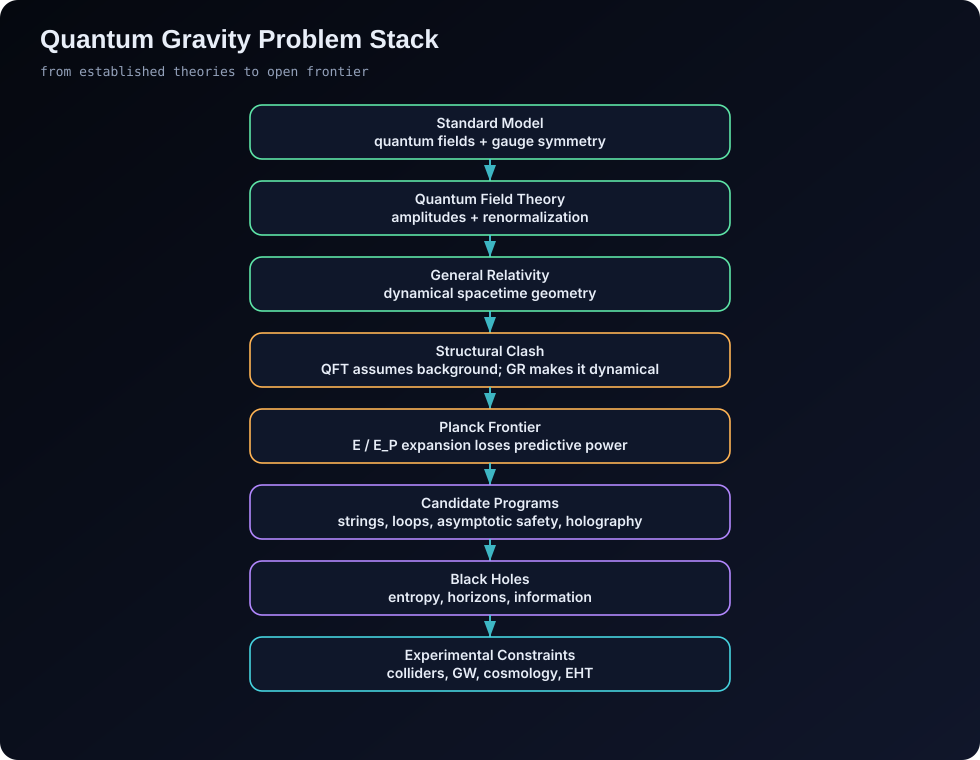
</p>

### Black-Hole Information Flow

<p align="center">
  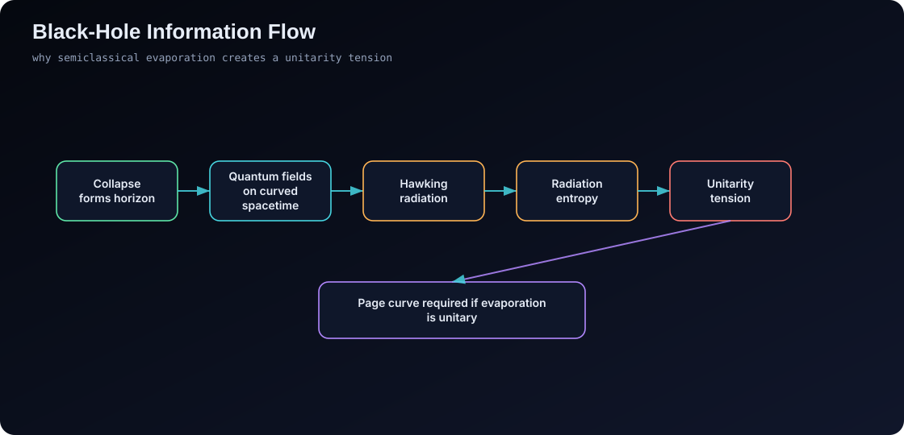
</p>

### Renderer Pipeline

<p align="center">
  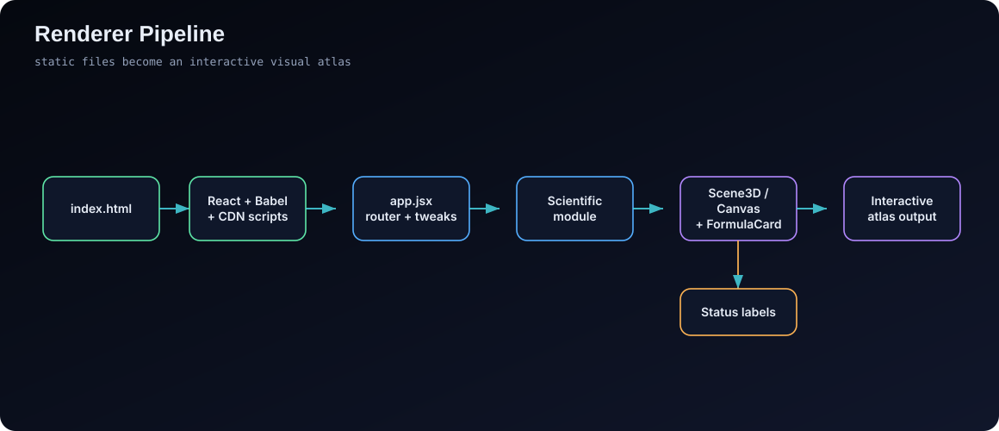
</p>

### Theory Comparator Map

<p align="center">
  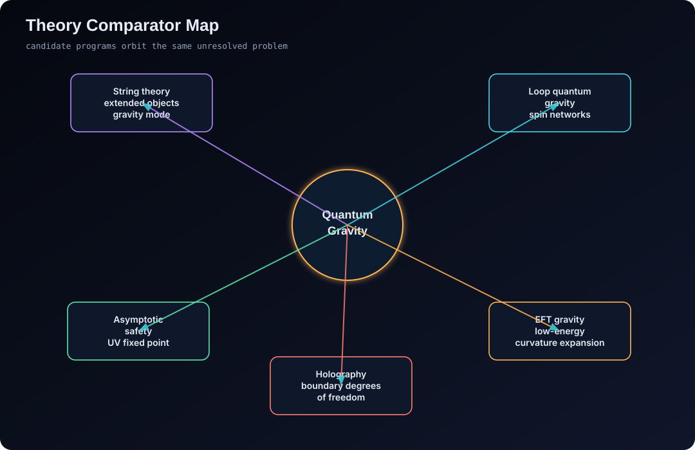
</p>

### Screenshot Reproducibility Flow

<p align="center">
  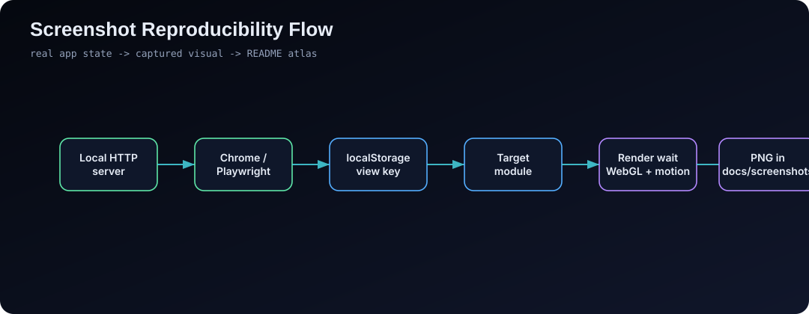
</p>

---

## Feature Inventory

| Feature | Implementation | Why it matters |
|---|---|---|
| shared cinematic stage | `Scene3D` in `js/scene3d.jsx` | consistent camera, controls, labels, and fallbacks |
| ambient atlas background | `AtlasStage` in `js/atlas-stage.jsx` | gives the app a continuous scientific atmosphere |
| learning pathways | `QGA_PATHWAYS` and tweaks | adapts explanatory depth |
| status badges | `Badge`, `VizCaption`, `FormulaCard` | keeps epistemic claims visible |
| formula cards | KaTeX rendering and symbol definitions | turns equations into readable interface units |
| black-hole raymarcher | shader-based scene in `mod-blackholes.jsx` | strongest visual surface for horizon physics |
| QFT collision lab | process selector and 3D scene in `mod-qft.jsx` | connects amplitudes, diagrams, and event intuition |
| QFT amplitude room | live Mandelstam/angular/resonance bench in `mod-qft.jsx` | turns the Feynman rules into numbers the reader can move |
| GR curvature engine | scene in `mod-gr.jsx` | visualizes geodesics and lensing |
| Planck ladder | scene in `mod-planck.jsx` | makes the scale desert explicit |
| collider and GW labs | `mod-experiments.jsx` | shows indirect constraints |

---

## Technical Architecture

```text
horizon-quantum-gravity-atlas/
├── index.html
├── Quantum Gravity Atlas.html
├── README.md
├── LICENSE
├── manifest.webmanifest
├── package.json
├── tweaks-panel.jsx
├── .github/
│   └── workflows/
│       └── quality.yml
├── docs/
│   ├── diagrams/
│   │   ├── 01-architecture-preview.svg
│   │   ├── 02-atlas-state-flow.svg
│   │   ├── 03-module-render-sequence.svg
│   │   └── ...
│   ├── icons/
│   │   ├── favicon-16.png
│   │   ├── favicon-32.png
│   │   ├── apple-touch-icon.png
│   │   ├── icon-192.png
│   │   └── icon-512.png
│   ├── screenshots/
│       ├── 01-black-hole-kerr-raymarch.png
│       ├── 02-holographic-boundary-bulk.png
│       ├── 03-qft-feynman-collision.png
│       ├── 04-planck-scale-foam.png
│       ├── 05-spacetime-curvature-lensing.png
│       ├── 06-collider-event-display.png
│       ├── 07-gravitational-wave-inspiral.png
│       ├── 08-theory-constellation.png
│       ├── 09-mobile-black-hole-lab.png
│       ├── 10-kerr-observatory-layers.png
│       ├── 11-kerr-observatory-mobile.png
│       ├── 12-gw-theatre.png
│       ├── 12b-gw-theatre-real.png
│       └── 13-gw-theatre-mobile.png
│   └── social/
│       └── og-image.png
├── scripts/
│   └── validate-repo.mjs
└── js/
    ├── app.jsx
    ├── atlas-stage.jsx
    ├── core.jsx
    ├── data.jsx
    ├── extras.jsx
    ├── scene3d.jsx
    ├── mod-standard-model.jsx
    ├── mod-qft.jsx
    ├── mod-gauge-rg.jsx
    ├── mod-gr.jsx
    ├── mod-planck.jsx
    ├── mod-approaches.jsx
    ├── mod-blackholes.jsx
    └── mod-experiments.jsx
```

### Runtime Stack

| Layer | Technology | Notes |
|---|---|---|
| UI runtime | React 18 UMD | loaded directly in browser |
| JSX transform | Babel Standalone | no bundler required |
| 3D renderer | Three.js r147 | WebGL scenes and cinematic modules |
| equations | KaTeX | formula rendering |
| fallback simulations | Canvas 2D | analytical and low-support rendering |
| persistence | `localStorage` | selected view and tweak settings |
| deployment | static hosting | GitHub Pages compatible |

---

## Quality Gates

The repository includes a lightweight validation suite for the README, metadata, diagrams, screenshots, icons, and social preview assets, plus focused Node tests for the pure physics/reproducibility helpers.

```bash
npm run validate
```

The same check runs in GitHub Actions through `.github/workflows/quality.yml`.

The validation currently enforces:

- no dynamic diagram fences in the README;
- all README local image paths exist;
- at least nine cinematic screenshots are referenced;
- at least eleven static SVG diagrams are referenced;
- Open Graph and Twitter card metadata exists in both HTML entry files;
- `manifest.webmanifest` is valid JSON and points to real icons;
- PNG assets have the expected dimensions;
- diagram SVG files are structurally complete.

This is not a physics test suite.

It is a repository-presentation guardrail that prevents broken academic packaging, missing assets, and GitHub README rendering regressions.

The physics itself is covered separately by `test/physics.test.mjs`, which runs under `node --test` and is executed by the same workflow.

---

## Reproducible sharing and data modes

The active module, learning pathway, black-hole mass/spin, gravitational-wave controls (mode, event, detector, GPS range, component masses), QFT amplitude-room controls (process, √s, cos θ, Compton x), and seed are encoded in the URL query string. Browser back/forward navigation restores those values. Use **Copy link** to share an exact state or **Export JSON** to download a portable state record with a schema version and provenance fields.

Generated visual data uses the recorded seed rather than ambient randomness, so a shared state is reproducible. The gravitational-wave **Signal Analysis Theatre** renders a seeded dual-detector (H1/L1) leading-order chirp with an inspiral–merger–ringdown phase ribbon, a live Hann-windowed STFT spectrogram computed from the displayed samples, and chirp-mass/coalescence-time readouts from the exact leading-order scalings. An animated playback engine sweeps a shared playhead across both instruments — with play/pause, replay, 0.5–4× speed, drag-to-scrub on the progress bar or any trace, a hover crosshair reporting time, strain, and instantaneous frequency, and a merger flash at coalescence — while component-mass sliders (m₁, m₂, URL-encoded as `gwm1`/`gwm2`) reshape the waveform live. Playback is presentation-only: the underlying signals stay seed-deterministic, and animation pauses when the OS requests reduced motion. It also offers a bounded **GWOSC API v2 strain mode** for a named event, detector, GPS range, and 4 kHz text strain product. It caps the compressed and decompressed response, downsamples the calibrated observation for a small browser preview, and shows the event, detector, units, processing, and source links. It times out quickly and falls back to the seeded local waveform when the network, browser decompression, or selected data product is unavailable. The spectrogram is an STFT — not a Q-transform — and the preview's effective sample rate sets its Nyquist limit, which the interface states explicitly.

The theatre's presentation is driven by an explicit state machine — `idle`, `loading`, `real`, `generated`, `error`, `cancelled` — surfaced as a colour-coded status pill with a live dot, the human-readable status sentence, and a contextual **Cancel** (while loading) or **Retry** (after an error or cancellation) action. A superseded or user-cancelled request never overwrites the phase the reader has already moved on to. The shared vertical scale eases toward the new peak whenever the signal changes, so switching seed, mode, or component masses rescales the trace smoothly instead of jumping; the ease is bounded (it stops once settled) and snaps instantly under reduced motion. The observation readout group and the provenance line animate in when real data lands, and the leading edge of the revealed trace carries a mode-coloured glow — blue for the generated teaching signal, cyan for the GWOSC observation — so the two are never visually confusable.

The **Kerr Black Hole Observatory** animates its equatorial coordinate map rather than redrawing it: horizon, ergosphere, photon-orbit, and ISCO radii interpolate with a cubic ease-out whenever mass or spin changes, the map reports a `settling` state while it moves, and the camera presets ease between viewpoints instead of cutting. A **live formulation** panel prints the governing relations with the current numbers substituted — the horizon pair $r_\pm = M \pm \sqrt{M^2 - a^2}$, the ergosurface $r_E = M + \sqrt{M^2 - a^2\cos^2\theta}$ at both the equator and the pole, the prograde and retrograde photon orbits, the ISCO closed form with its $Z_1$/$Z_2$ intermediates, the surface-gravity ratio, the entropy area law, and the Hawking temperature — each row updating as the sliders move. Printed numbers always come from the exact geometry, never from the eased animation values, and the panel closes with an explicit note separating the exact Kerr coordinate radii from the approximate raymarch image.

The official API source used is https://gwosc.org/api/, with v2 documentation and schema at https://gwosc.org/api/v2/docs (schema: `/api/v2/schema`).

The QFT **Amplitude Room** is a live 2 → 2 scattering bench. It evaluates the Mandelstam variables from the four-momenta, the angular differential cross-section, the photon 1/s total cross-section, and the Z⁰ Breit–Wigner shape on every frame, using the pure functions in `js/physics.mjs` (mirrored in `js/physics.jsx` for the browser). Three processes are offered: s-channel e⁺e⁻ → μ⁺μ⁻ (1 + cos²θ), t-channel e⁻μ⁻ → e⁻μ⁻ (leading pole 1/sin⁴(θ/2)), and Compton γe⁻ → γe⁻ (Klein–Nishina). The transport bar scrubs a normalised collision phase τ ∈ [0, 1] with play/pause, replay, and 0.5–4× speed; the animation is presentation only and the readouts do not depend on it. Playback is disabled when the OS requests reduced motion. Each of the four instrument panels carries a titled header bar, and the transport strip reports the live collision phase (incoming / interaction / outgoing) next to the clock, so the schematic canvases are always labelled as schematic. The t-channel curve deliberately plots only the leading pole — the complete Møller and Bhabha amplitudes also carry s- and u-channel terms and their interference, which are not drawn. The Z⁰ panel shows the Breit–Wigner shape alone, not the γ–Z⁰ interference term. The Compton slider x = E_γ/mₑc² is a lab-frame ratio and is deliberately decoupled from √s.

## Run Locally

Use a local HTTP server.

Do not open `index.html` directly with `file://`.

The app loads scripts as separate files, so an HTTP server is the reliable route.

```bash
npm start
```

Alternative:

```bash
npx serve .
```

Alternative:

```bash
python -m http.server 8000
```

Then open:

```text
http://127.0.0.1:8000/
```

---

## Screenshot Reproduction Guide

The current screenshots were regenerated from the live app.

The capture target was:

```text
http://127.0.0.1:8000/
```

The screenshot set emphasizes visual and animated modules:

| File | Target view | Main visual purpose |
|---|---|---|
| `01-black-hole-kerr-raymarch.png` | `bh` | black-hole raymarching, horizon, disk lensing |
| `02-holographic-boundary-bulk.png` | `bh` | boundary-bulk holography |
| `03-qft-feynman-collision.png` | `qft` | scattering event and Feynman diagram |
| `04-planck-scale-foam.png` | `planck` | scale descent and speculative Planck grid |
| `05-spacetime-curvature-lensing.png` | `gr` | geodesics and curvature |
| `06-collider-event-display.png` | `exp` | collider tracks and detector geometry |
| `07-gravitational-wave-inspiral.png` | `exp` | binary inspiral and gravitational waves |
| `08-theory-constellation.png` | `approaches` | quantum-gravity program map |
| `09-mobile-black-hole-lab.png` | `bh` | responsive black-hole module |
| `10-kerr-observatory-layers.png` | `bh` | Kerr observatory with exact-coordinate radii map |
| `11-kerr-observatory-mobile.png` | `bh` | mobile Kerr observatory, collapsible map |
| `12-gw-theatre.png` | `exp` | GW analysis theatre mid-playback: dual strain, playhead, STFT + chirp track, transport |
| `12b-gw-theatre-real.png` | `exp` | GWOSC real-observation mode with provenance |
| `13-gw-theatre-mobile.png` | `exp` | mobile GW theatre, stacked instrument panels |
| `14-qft-amplitude-room.png` | `qft` | amplitude room: scattering plane, interference waterfall, angular plot, Z⁰ resonance |
| `15-qft-amplitude-room-mobile.png` | `qft` | mobile amplitude room, single-column instrument stack |

Capture criteria:

- screenshot must come from a real running app state;
- screenshot must show a scientific visualization, not only text;
- black-hole screenshots must remain prominent;
- conjectural scenes must remain labeled;
- the README must not imply observational confirmation where none exists.

---

## Scientific Module Notes

### Module 01 — Standard Model

The Standard Model module maps known elementary particles.

It includes quarks, leptons, gauge bosons, and the Higgs boson.

It connects particle identity to charge, spin, generation, interaction channels, mass, and discovery context.

The core pedagogical transition is from a particle table to field representations.

The module makes clear that gravity is absent from the Standard Model gauge group.

It also flags neutrino mass, dark matter, matter-antimatter asymmetry, and the hierarchy problem as unresolved.

### Module 02 — Quantum Field Theory

The QFT module treats particles as localized excitations of fields.

It includes a Klein-Gordon membrane that can be excited interactively.

It includes a Feynman collision builder.

It includes an amplitude room that converts a diagram into numbers: Mandelstam variables, angular distributions, and the Z⁰ resonance, all evaluated live from the pure physics functions.

It shows how a diagram is not a picture of a literal microscopic movie.

It is a term in a perturbative expansion.

The module links field amplitude, dispersion relation, propagator, amplitude, and cross-section.

### Module 03 — Gauge Symmetry and RG Flow

The gauge module explains local symmetry.

It shows why gauge fields are required when phase choices vary from point to point.

It introduces running couplings.

It shows how renormalization turns scale into a physical variable.

It prepares the reader for the gravitational obstruction by contrasting marginal gauge couplings with Newton's dimensionful coupling.

### Module 04 — General Relativity

The GR module reframes gravity as geometry.

It shows a deformable spatial slice.

It adds geodesic motion and light-bending rays.

It compares relativistic geometry with Newtonian intuition.

It includes Einstein's equations, the geodesic equation, and the Einstein-Hilbert action.

It also notes that classical GR predicts singularities.

### Module 05 — Planck Frontier

The Planck module identifies where the tension becomes unavoidable.

It explains background independence and the problem of time.

It explains perturbative non-renormalizability.

It shows the scale ladder from human dimensions to the Planck length.

Its foam-like visualization is explicitly labeled schematic.

The app does not claim spacetime is actually a foam lattice.

### Module 06 — Theory Comparator

The theory comparator avoids declaring a winner.

It compares string theory, loop quantum gravity, effective field theory, asymptotic safety, and holography.

The 3D constellation is a mnemonic map.

The real comparison is conceptual:

- What are the fundamental objects?
- Is the framework background independent?
- How does spacetime emerge or persist?
- What does it say about black-hole entropy?
- What does it predict or fail to predict experimentally?

### Module 07 — Black Holes

The black-hole module is the theoretical laboratory of the atlas.

It joins GR, QFT, and thermodynamics.

It visualizes ray-bent accretion disk light.

It computes horizon radius, Kerr quantities, Hawking temperature, entropy, and evaporation scaling.

It includes the Page curve and a holographic boundary-bulk visualization.

It states clearly that Hawking radiation is not directly observed.

It states clearly that black-hole microstates remain incompletely understood in the generic case.

### Module 08 — Experiment

The experiment module shows the observational net.

It includes collider event displays.

It includes resonance reconstruction.

It includes gravitational-wave inspiral.

It includes a wider map of constraints.

It distinguishes confirmed strong-field GR from unconfirmed quantum-gravity signatures.

---

## Academic Integrity Notes

This README is intentionally explicit about limitations.

That is not a weakness.

It is a scientific requirement.

The most common failure mode in quantum-gravity outreach is to blend speculation with established result.

HORIZON avoids that by making the epistemic state part of the UI.

### What the App May Claim

- Quantum field theory is the established framework of the Standard Model.
- General relativity is the established classical theory of gravity.
- Low-energy quantum gravity can be treated as an effective field theory.
- Black-hole thermodynamics is a semiclassical theoretical landmark.
- Collider and gravitational-wave observations constrain theory space.

### What the App Must Not Claim

- It must not claim a complete quantum-gravity theory is confirmed.
- It must not claim Planck-scale discreteness is observed.
- It must not claim Hawking radiation from astrophysical black holes has been directly detected.
- It must not claim AdS/CFT is the proven description of our universe.
- It must not claim a schematic 3D visualization is a literal measurement.

---

## User Experience Model

<p align="center">
  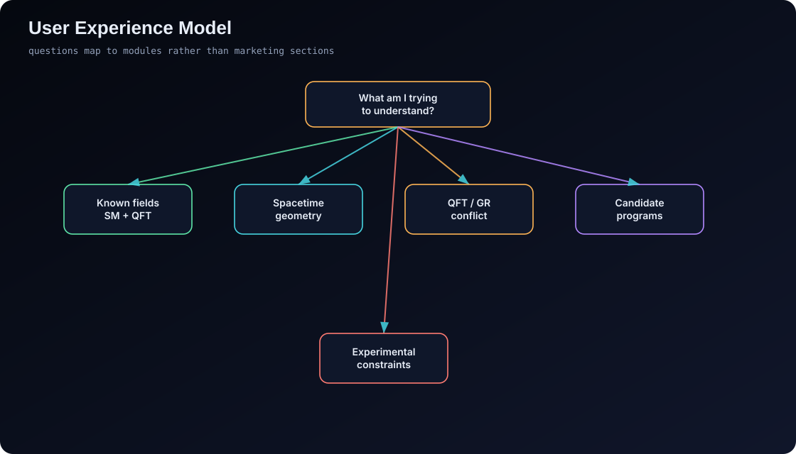
</p>

---

## Accessibility and Responsiveness

The application includes:

- keyboard-aware 3D controls;
- reduced-motion support;
- ARIA labels on interactive scenes;
- 2D fallbacks for WebGL failure;
- status labels that do not rely only on color;
- responsive navigation for narrow screens.

The mobile black-hole screenshot documents that the visual module remains accessible on smaller viewports.

---

## Performance Notes

The app is static, but the visual scenes are nontrivial.

The black-hole module uses a shader-based lensing approximation.

The QFT and GR modules use Three.js scene construction.

The Planck and experiment modules animate grids, particles, or detector structures.

Performance-sensitive users can adjust:

- visualization mode;
- motion level;
- 3D detail level;
- label visibility;
- annotation visibility;
- ambient starfield.

These controls are available through the in-app tweaks panel.

---

## Deployment

The project can be hosted on any static site host.

GitHub Pages is sufficient.

Suggested GitHub Pages configuration:

1. Push the repository to GitHub.
2. Open repository **Settings**.
3. Open **Pages**.
4. Select **Deploy from a branch**.
5. Choose the `main` branch.
6. Choose the repository root.
7. GitHub Pages will serve `index.html`.

No server rewrite rules are required.

No database is required.

No environment variables are required.

The deployed app includes:

- canonical URL metadata;
- Open Graph and Twitter large-card metadata;
- a 1200x630 social preview image;
- SVG and PNG favicon paths;
- Apple touch icon metadata;
- install metadata through `manifest.webmanifest`.

---

## Development Notes

The codebase intentionally avoids build-system complexity.

That makes the project easy to inspect.

It also means browser loading order matters.

The module scripts are declared from `index.html`.

The app shell expects module constructors to be assigned to `window`.

The shared helpers are attached globally from `core.jsx`, `scene3d.jsx`, and `data.jsx`.

This pattern favors educational transparency over modern bundler ergonomics.

---

## References

The app includes a larger in-app references list.

The following are especially central:

1. A. Einstein, "Die Feldgleichungen der Gravitation," Sitzungsberichte der Preussischen Akademie der Wissenschaften, 1915.
2. P. A. M. Dirac, "The Quantum Theory of the Electron," Proceedings of the Royal Society A, 1928.
3. R. P. Feynman, "Space-Time Approach to Non-Relativistic Quantum Mechanics," Reviews of Modern Physics, 1948.
4. C. N. Yang and R. L. Mills, "Conservation of Isotopic Spin and Isotopic Gauge Invariance," Physical Review, 1954.
5. S. Weinberg, "A Model of Leptons," Physical Review Letters, 1967.
6. D. J. Gross and F. Wilczek, "Ultraviolet Behavior of Non-Abelian Gauge Theories," Physical Review Letters, 1973.
7. H. D. Politzer, "Reliable Perturbative Results for Strong Interactions?," Physical Review Letters, 1973.
8. J. D. Bekenstein, "Black Holes and Entropy," Physical Review D, 1973.
9. S. W. Hawking, "Particle Creation by Black Holes," Communications in Mathematical Physics, 1975.
10. G. 't Hooft and M. Veltman, "One-loop divergencies in the theory of gravitation," Annales de l'Institut Henri Poincare A, 1974.
11. S. Weinberg, "Ultraviolet divergences in quantum theories of gravitation," in *General Relativity: An Einstein Centenary Survey*, 1979.
12. M. H. Goroff and A. Sagnotti, "The ultraviolet behavior of Einstein gravity," Nuclear Physics B, 1986.
13. A. Ashtekar, "New Variables for Classical and Quantum Gravity," Physical Review Letters, 1986.
14. G. 't Hooft, "Dimensional Reduction in Quantum Gravity," arXiv:gr-qc/9310026, 1993.
15. L. Susskind, "The World as a Hologram," Journal of Mathematical Physics, 1995.
16. A. Strominger and C. Vafa, "Microscopic Origin of the Bekenstein-Hawking Entropy," Physics Letters B, 1996.
17. J. Maldacena, "The Large N Limit of Superconformal Field Theories and Supergravity," Advances in Theoretical and Mathematical Physics, 1998.
18. J. F. Donoghue, "General relativity as an effective field theory: The leading quantum corrections," Physical Review D, 1994.
19. S. Ryu and T. Takayanagi, "Holographic Derivation of Entanglement Entropy from AdS/CFT," Physical Review Letters, 2006.
20. ATLAS and CMS Collaborations, Higgs boson discovery papers, Physics Letters B, 2012.
21. LIGO Scientific and Virgo Collaborations, "Observation of Gravitational Waves from a Binary Black Hole Merger," Physical Review Letters, 2016.
22. Event Horizon Telescope Collaboration, "First M87 Event Horizon Telescope Results," Astrophysical Journal Letters, 2019.
23. G. Penington, "Entanglement Wedge Reconstruction and the Information Paradox," JHEP, 2020.
24. A. Almheiri, N. Engelhardt, D. Marolf, and H. Maxfield, "The entropy of bulk quantum fields and the entanglement wedge of an evaporating black hole," JHEP, 2019.
25. M. E. Peskin and D. V. Schroeder, *An Introduction to Quantum Field Theory*, 1995.
26. S. Weinberg, *The Quantum Theory of Fields*, Vols. I-II, 1995-1996.
27. C. W. Misner, K. S. Thorne, and J. A. Wheeler, *Gravitation*, 1973.
28. R. M. Wald, *General Relativity*, 1984.
29. J. Polchinski, *String Theory*, Vols. I-II, 1998.
30. C. Rovelli, *Quantum Gravity*, 2004.

---

## Roadmap

High-value future improvements:

- generate reproducible screenshot scripts committed to `docs/`;
- add Playwright visual regression tests for every module;
- add a compact mathematical glossary page;
- add a separate academic whitepaper in `docs/`;
- self-host CDN assets for long-term archival stability;
- add a proper citation file (`CITATION.cff`);
- add a screenshot manifest with viewport, view, scroll position, and render settings;
- extend the pure-physics test suite to the remaining modules (GR, Planck, and the black-hole thermodynamics helpers beyond the covered horizon, ergosphere, ISCO, temperature, and entropy scalings);
- add a causal-spacetime laboratory with an interactive light-cone and event-ordering explorer;
- add a renormalisation-group flow landscape with a live β-function integrator.

Completed since the first release:

- deep-link support through query parameters, with back/forward restoration and documented fallback;
- a GitHub Pages deployment workflow;
- a focused Node test suite for the pure physics and reproducibility helpers;
- a bounded real-data mode for the gravitational-wave laboratory;
- a Kerr Observatory with an exact coordinate-radius map, eased geometry transitions, eased camera presets, and a live formulation panel that substitutes the current parameters into the implemented Kerr relations;
- a gravitational-wave presentation state machine (`idle` / `loading` / `real` / `generated` / `error` / `cancelled`) with cancel and retry, an eased shared vertical scale, and animated observation/provenance reveals.

---

## Extended Academic Appendix

This appendix turns the README into a research-style dossier.

It is written for readers who want more than a gallery.

It provides symbol inventory, formal constraints, theory comparison, black-hole thermodynamic bookkeeping, and experimental interpretation rules.

### Appendix A — Core Symbol Table

| Symbol | Domain | Meaning | Module |
|---|---|---|---|
| $c$ | constant | speed of light in vacuum | all |
| $\hbar$ | constant | reduced Planck constant | QFT, Planck, black holes |
| $G$ | constant | Newton gravitational constant | GR, Planck, black holes |
| $k_B$ | constant | Boltzmann constant | black-hole thermodynamics |
| $g_{\mu\nu}$ | tensor | spacetime metric | GR |
| $\eta_{\mu\nu}$ | tensor | Minkowski metric | QFT, perturbative gravity |
| $h_{\mu\nu}$ | tensor field | metric perturbation / graviton field | Planck frontier |
| $R_{\mu\nu}$ | tensor | Ricci curvature | GR |
| $R$ | scalar | Ricci scalar | GR |
| $G_{\mu\nu}$ | tensor | Einstein tensor | GR |
| $T_{\mu\nu}$ | tensor | stress-energy tensor | GR |
| $\Lambda$ | scalar | cosmological constant | GR, open problems |
| $\Gamma^\mu_{\alpha\beta}$ | connection | Christoffel symbols | GR |
| $\phi$ | field | scalar field | QFT |
| $\psi$ | field | spinor field | Standard Model, QFT |
| $A_\mu$ | field | gauge potential | gauge theory |
| $F_{\mu\nu}$ | tensor | gauge field strength | gauge theory |
| $g_s$ | coupling | strong coupling | Standard Model |
| $g$ | coupling | weak coupling | Standard Model |
| $g'$ | coupling | hypercharge coupling | Standard Model |
| $\alpha$ | coupling | fine-structure constant or generic coupling | QFT |
| $\beta(g)$ | function | renormalization-group beta function | RG |
| $E_P$ | scale | Planck energy | Planck frontier |
| $\ell_P$ | scale | Planck length | Planck frontier |
| $m_P$ | scale | Planck mass | Planck frontier |
| $t_P$ | scale | Planck time | Planck frontier |
| $r_s$ | length | Schwarzschild radius | black holes |
| $r_+$ | length | Kerr outer horizon radius | black holes |
| $a_\star$ | scalar | dimensionless Kerr spin parameter | black holes |
| $A$ | area | horizon area | black holes |
| $S_{BH}$ | entropy | Bekenstein-Hawking entropy | black holes |
| $T_H$ | temperature | Hawking temperature | black holes |
| $Q_{ij}$ | tensor | mass quadrupole tensor | experiments |
| $s,t,u$ | invariants | Mandelstam variables | QFT |
| $\Gamma_Z$ | width | $Z^0$ decay width | experiments |
| $M_Z$ | mass | $Z^0$ mass | experiments |

### Appendix B — Dimensional Analysis Backbone

Dimensional analysis is one of the cleanest routes into the quantum-gravity problem.

In natural units where $\hbar=c=1$, action is dimensionless.

The Lagrangian density in four spacetime dimensions has mass dimension $4$.

A scalar field has mass dimension $1$.

A Dirac spinor has mass dimension $3/2$.

A gauge field has mass dimension $1$.

The Yang-Mills coupling is dimensionless.

Newton's constant has mass dimension $-2$.

Therefore gravitational perturbation theory contains a coupling that grows with energy.

The schematic expansion parameter is:

```math
\kappa E \sim \frac{E}{E_P}
```

At low energy this is small.

At Planck energy this is order unity.

Above that scale perturbation theory loses the hierarchy that made it predictive.

This is why the atlas does not frame quantum gravity as merely "hard mathematics."

It is structurally different from renormalizable gauge theory.

### Appendix C — Effective Field Theory Logic

Effective field theory does not mean "fake theory."

It means "valid below a scale."

The low-energy action contains all operators compatible with the symmetries.

Operators are ordered by relevance under scaling.

For gravity, the expansion is controlled by curvature over the Planck scale.

The leading term is the Einstein-Hilbert action.

The next terms are higher-curvature corrections.

The coefficients encode ultraviolet physics not resolved by the EFT.

The EFT is predictive at low energy because only finitely many terms matter at a given precision.

The EFT is incomplete because it cannot determine the ultraviolet completion.

This is the distinction the README preserves:

- low-energy quantum gravity: controlled effective theory;
- Planck-scale quantum gravity: open problem;
- candidate UV completions: conjectural frameworks.

### Appendix D — Quantum-Gravity Program Comparison

| Program | Fundamental move | Strength | Main unresolved issue | Status |
|---|---|---|---|---|
| String theory | replace point particles with one-dimensional extended objects | perturbative finiteness and graviton mode | vacuum selection and low-energy predictions | conjectural |
| Loop quantum gravity | quantize geometry using holonomies and fluxes | background independence | dynamics and semiclassical limit | conjectural |
| Asymptotic safety | seek interacting UV fixed point | possible nonperturbative renormalizability | truncation control and empirical signatures | conjectural |
| EFT gravity | quantize GR below the Planck scale | controlled low-energy predictions | no UV completion | effective |
| Holography | encode bulk gravity in boundary quantum theory | black-hole information and entanglement geometry | special backgrounds and cosmology | conjectural |
| Causal sets | replace continuum with locally finite order | built-in causal discreteness | continuum recovery and dynamics | conjectural |
| Causal dynamical triangulations | sum over causal geometries | numerical continuum phases | matter coupling and analytic control | conjectural |
| Emergent gravity | spacetime/gravity arise from deeper degrees of freedom | reframes geometry and thermodynamics | identifying the underlying system | conjectural |

### Appendix E — Program Evaluation Questions

Every candidate quantum-gravity program is evaluated against the same questions.

1. Does it recover general relativity at macroscopic scales?

2. Does it recover quantum field theory in weakly curved regimes?

3. Does it reproduce black-hole entropy?

4. Does it offer a unitary account of evaporation?

5. Does it define local or relational observables?

6. Does it preserve Lorentz symmetry or explain its apparent low-energy validity?

7. Does it address the cosmological constant problem?

8. Does it make testable predictions?

9. Does it explain singularity resolution?

10. Does it provide a nonperturbative definition?

11. Does it remain mathematically controlled?

12. Does it distinguish background independence from background covariance?

13. Does it define time fundamentally or relationally?

14. Does it include Standard Model matter naturally?

15. Does it explain why the classical limit looks four-dimensional?

The app does not claim any program satisfies all of these.

That is precisely why the comparator exists.

### Appendix F — Black-Hole Derivation Checklist

The black-hole module centers on a compact chain of results.

Start from Schwarzschild geometry:

```math
ds^2 =
-\left(1-\frac{2GM}{c^2r}\right)c^2dt^2
+\left(1-\frac{2GM}{c^2r}\right)^{-1}dr^2
+r^2d\Omega^2
```

The event horizon occurs at:

```math
r = r_s = \frac{2GM}{c^2}
```

The area is:

```math
A = 4\pi r_s^2
```

Substitute $r_s$:

```math
A = 16\pi \frac{G^2M^2}{c^4}
```

The entropy is:

```math
S_{BH}
=
\frac{k_Bc^3A}{4G\hbar}
```

Substitute $A$:

```math
S_{BH}
=
4\pi k_B \frac{GM^2}{\hbar c}
```

The Hawking temperature is:

```math
T_H =
\frac{\hbar c^3}{8\pi GMk_B}
```

Notice the inverse mass scaling.

Larger black holes are colder.

Smaller black holes are hotter.

This implies negative specific heat.

It also makes astrophysical Hawking radiation extremely hard to observe.

### Appendix G — Kerr Quantities Used by the App

The visual black-hole scene is pedagogical.

The readout layer tracks Kerr-inspired quantities.

For dimensionless spin $a_\star$:

```math
0 \le a_\star < 1
```

The outer horizon decreases as spin increases:

```math
r_+ = M + \sqrt{M^2-a^2}
```

In geometric units:

```math
G=c=1
```

The prograde ISCO decreases from $6M$ toward $M$ as the extremal limit is approached.

The ergosphere at the equator occurs at:

```math
r_{\mathrm{ergo}} = 2M
```

Away from the equator the stationary-limit surface is polar-angle dependent:

```math
r_E(\theta) = M + \sqrt{M^2 - a^2\cos^2\theta}
```

which reduces to $2M$ at $\theta = 90^\circ$ and to $r_+$ at the pole. The observatory's live formulation panel prints both values for the current spin.

The visual disk is not a numerical GRMHD simulation.

It is a cinematic ray-bending approximation.

The README makes this explicit to avoid overclaiming.

### Appendix H — Information Paradox Decision Tree

<p align="center">
  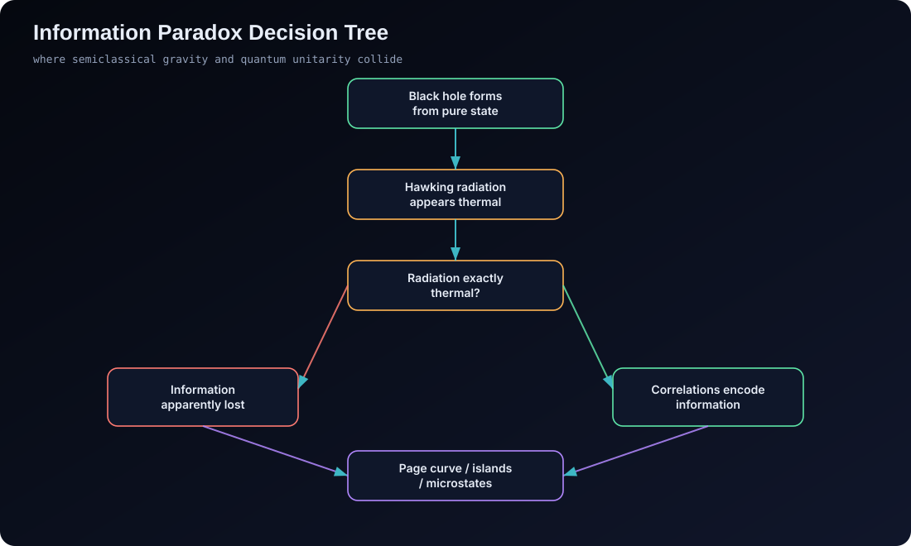
</p>

### Appendix I — Experimental Constraint Taxonomy

| Channel | What is measured | What it constrains | What it does not prove |
|---|---|---|---|
| LHC collisions | high-energy particle events | TeV-scale new physics, extra dimensions, supersymmetry bounds | Planck-scale quantum gravity |
| Resonance searches | invariant-mass peaks | new particles or excluded mass ranges | absence of all UV completions |
| Gravitational waves | strong-field merger waveforms | deviations from GR, dispersion, echoes | direct graviton detection |
| EHT images | black-hole shadow geometry | horizon-scale compact-object structure | Hawking radiation |
| CMB anisotropies | early-universe perturbations | inflationary and cosmological parameters | direct Planck-scale discreteness |
| Lorentz tests | high-energy photon timing and dispersion | Lorentz-violation models | all quantum-gravity models |
| Short-range gravity | deviations from inverse-square law | large extra dimensions, fifth forces | generic quantum gravity |
| Precision clocks | gravitational redshift and equivalence | equivalence-principle violations | complete spacetime quantization |

### Appendix J — Observational Honesty Rules

If a result is measured, name the measurement.

If a result is inferred, name the inference.

If a scene is schematic, label it as schematic.

If a framework is conjectural, label it as conjectural.

If a claim depends on a special background, state the background.

If a scale is inaccessible, state the gap.

If a formula is semiclassical, state which ingredients are classical and which are quantum.

If a visualization simplifies time, geometry, or dynamics, say so.

If a theory recovers a result only in a special case, say so.

If an experiment constrains but does not confirm a model, say so.

### Appendix K — Formula Card Design Specification

Each formula card should answer five questions.

1. What is the equation?

2. What are the symbols?

3. What does it mean physically?

4. What domain is it valid in?

5. What misconception could it create?

Example:

```text
Formula: S_BH = k_B A / 4 l_P^2
Meaning: entropy scales with horizon area, not volume
Domain: semiclassical black-hole thermodynamics
Risk: may be mistaken as a fully understood microscopic count for generic black holes
Status: established semiclassical formula, unresolved microstate interpretation
```

### Appendix L — Visual Scene Audit

| Scene | Visual strength | Scientific risk | README treatment |
|---|---|---|---|
| black-hole raymarch | very high | mistaken for exact GRMHD or observation | label as schematic/cinematic |
| holography boundary-bulk | high | mistaken for literal universe projection | label as conjectural |
| Planck foam | high | mistaken for established discreteness | label as schematic/speculative |
| QFT collision | high | mistaken for literal virtual-particle trajectory | explain diagrams as perturbative terms |
| curvature grid | high | rubber-sheet misconception | explicitly distinguish spatial slice from full spacetime curvature |
| collider event | high | mistaken for real detector reconstruction | label as stylized |
| gravitational wave sheet | high | mistaken for quantum-gravity signal | frame as GR-confirming observation |
| theory constellation | medium-high | mistaken for ranking | state no winner implied |

### Appendix M — Static Diagram Rendering Notes

Markdown-native diagram blocks can depend on GitHub's rich-display asset pipeline.

This repository uses committed SVG diagrams instead.

The README uses static SVG diagrams for:

- architecture flow;
- state transitions;
- status taxonomy;
- black-hole information flow;
- renderer pipeline;
- theory comparison;
- screenshot reproducibility.

The diagrams are intentionally not too dense and are stored under `docs/diagrams/`.

They should support scanning.

They should not replace the mathematical text.

They should not imply causal certainty where the subject is conjectural.

### Appendix N — App State Notes

The app stores the active view in:

```text
localStorage["qga-view"]
```

The tweak state is also persisted in local storage.

The shareable state grammar is implemented in `js/state.jsx` and `js/state-runtime.jsx`. The URL query string carries the active view, the learning pathway, the black-hole mass and spin, the gravitational-wave controls, the QFT amplitude-room controls, and the seed. Any key equal to its default is omitted, so a default state produces a clean URL.

| Parameter | Example | Purpose |
|---|---|---|
| `view` | `bh` | select module |
| `pathway` | `advanced` | choose explanation depth |
| `motion` | `full` | animation intensity |
| `detail` | `ultra` | 3D complexity |
| `labels` | `1` | show labels |
| `annotations` | `1` | show annotations |
| `accent` | `ffb454` | theme accent |
| `shot` | `black-hole` | optional capture preset |
| `seed` | `12345` | reproducible generated data |
| `bhm` / `bha` | `10` / `0.9` | black-hole mass and spin |
| `gwm1` / `gwm2` | `30` / `30` | gravitational-wave component masses |
| `qfp` | `compton` | QFT process |
| `qfs` | `91` | QFT centre-of-mass energy in GeV |
| `qfa` | `0.6` | QFT scattering cosine |
| `qfx` | `0.5` | Compton lab-frame photon ratio |

Numeric parameters are clamped to their documented ranges on read, and enum parameters fall back to their default when the value is not recognised. Module and pathway changes push a history entry; parameter tweaks replace the current entry, so sliders do not flood the back stack.

### Appendix O — Suggested GitHub Repository Metadata

Recommended description:

```text
An interactive scientific atlas of quantum gravity: live WebGL simulations, black-hole thermodynamics, QFT scattering, spacetime curvature, Planck-scale obstructions, and experimental constraints.
```

Recommended topics:

```text
quantum-gravity
general-relativity
quantum-field-theory
black-holes
holography
standard-model
threejs
webgl
physics-education
scientific-visualization
```

Recommended social preview:

```text
docs/screenshots/01-black-hole-kerr-raymarch.png
```

### Appendix P — Scientific Limitations Registry

| Limitation | Why it matters | Where the app mitigates it |
|---|---|---|
| no direct Planck-scale data | prevents confirmation of candidate theories | Planck module caveats |
| Hawking radiation unobserved | black-hole thermodynamics remains indirect | black-hole captions |
| visual grids can mislead | spacetime curvature is not a rubber sheet | GR caption |
| diagrams can mislead | virtual particles are not observed trajectories | QFT caption |
| t-channel curve is pole-only | the full Møller/Bhabha amplitude includes s- and u-channel interference | amplitude-room validity note |
| Z⁰ panel omits γ–Z⁰ interference | the plotted shape is the resonance alone, not the full cross-section | amplitude-room validity note |
| holography is background-specific | AdS/CFT is not automatically our universe | holography caption |
| collider energies far below Planck scale | null results are indirect | experiment module |
| no unique theory ranking | programs solve different subproblems | theory comparator |
| pure-physics coverage is partial | untested helpers can regress silently | `test/physics.test.mjs` covers the shared helpers; roadmap extends it |

### Appendix Q — Academic README Rubric

This README follows the style pattern visible in the author's other GitHub repositories.

It includes:

- centered hero visual;
- dense shields.io badge cluster;
- long-form scientific thesis;
- visual atlas;
- static SVG architecture;
- static SVG state and flow diagrams;
- mathematical formulation section;
- status taxonomy;
- module matrix;
- screenshot reproduction guide;
- technical architecture;
- limitation registry;
- references;
- citation block.

It avoids:

- vague marketing claims;
- unlabeled speculation;
- stock images;
- unsupported "breakthrough" wording;
- pretending a static visualization is a validated simulation engine.

### Appendix R — Suggested Reviewer Reading Paths

For a fast visual review:

1. Start with the hero black-hole image.

2. Scan the Visual Atlas.

3. Read the Module Matrix.

4. Check the Run Locally section.

For a scientific review:

1. Read Scientific Position.

2. Read Mathematical Formulations.

3. Read Scientific Status System.

4. Read Academic Integrity Notes.

5. Read References.

For an engineering review:

1. Read Architecture Preview.

2. Read Technical Architecture.

3. Read Screenshot Reproduction Guide.

4. Read Development Notes.

5. Read Roadmap.

For a portfolio review:

1. Start with badges.

2. Inspect black-hole, QFT, GR, and gravitational-wave screenshots.

3. Read Design Principles.

4. Read Feature Inventory.

5. Read Deployment.

### Appendix S — Extended Glossary

**Background independence**

A theory is background independent when spacetime geometry is not fixed in advance but is part of the dynamical system.

**Beta function**

A function describing how a coupling changes with energy scale.

**Black-hole entropy**

Entropy proportional to horizon area, suggesting that gravitational systems store information differently from ordinary volume-based systems.

**Causal structure**

The ordering of events by possible lightlike or timelike connections.

**Covariant derivative**

A derivative modified by connection fields so that local symmetry transformations remain meaningful.

**Effective field theory**

A theory valid below a cutoff scale, organized by all symmetry-allowed operators ordered by relevance.

**Event horizon**

A causal boundary beyond which future-directed paths cannot escape to infinity.

**Geodesic**

The straightest possible path in curved geometry.

**Holographic principle**

The idea that the degrees of freedom in a gravitational region may scale with boundary area rather than volume.

**Kerr black hole**

A rotating black-hole solution characterized by mass and angular momentum.

**Mandelstam variables**

Lorentz-invariant combinations of scattering momenta used in $2\to2$ processes.

**Metric tensor**

The field that defines distances, times, angles, and causal structure in general relativity.

**Page curve**

The expected time profile of radiation entropy if black-hole evaporation is unitary.

**Planck scale**

The scale built from $\hbar$, $G$, and $c$ where quantum and gravitational effects are both expected to be strong.

**Propagator**

A Green's function encoding how field excitations contribute between interaction points in perturbation theory.

**Renormalization**

The systematic organization of scale dependence and ultraviolet sensitivity in quantum field theory.

**Spin network**

A graph-like quantum state of geometry used in loop quantum gravity.

**String worldsheet**

The two-dimensional surface traced by a string moving through spacetime.

**UV completion**

A theory that remains well-defined at arbitrarily high energies or explains what replaces the low-energy theory.

### Appendix T — Final Scientific Guardrail

The most important sentence in the repository is not a formula.

It is this:

> No complete theory of quantum gravity has been experimentally confirmed.

The rest of the atlas is built around that sentence.

The screenshots can be beautiful.

The equations can be dense.

The diagrams can be elaborate.

But the boundary between knowledge and conjecture must remain visible.

---

### Appendix U — Release Audit Manifest

This README revision was prepared as a presentation-grade repository front page.

The following audit manifest records what the document is expected to contain.

| Requirement | Status | Evidence |
|---|---|---|
| professional academic English | applied | long-form scientific sections |
| visual-first screenshot set | applied | Visual Atlas |
| black-hole screenshots | applied | hero image and Visual Atlas rows |
| shields.io badges | applied | centered badge cluster |
| static SVG diagrams | applied | architecture, state, status, theory, renderer, information-flow diagrams |
| mathematical formulation | applied | Standard Model, QFT, GR, Planck, black-hole equations |
| epistemic caveats | applied | Scientific Position and Academic Integrity Notes |
| local run instructions | applied | Run Locally |
| static deployment notes | applied | Deployment |
| social preview metadata | applied | Social Preview and Install Metadata |
| install icon manifest | applied | `manifest.webmanifest` and `docs/icons/` |
| automated repository quality gate | applied | `.github/workflows/quality.yml` |
| scientific validity matrix | applied | Scientific Validity Matrix |
| reference layer | applied | References |
| citation block | applied | Citation |
| screenshot reproducibility | applied | Screenshot Reproduction Guide |

### Appendix V — Screenshot Manifest

The README now uses the following image contract.

Each screenshot has a scientific function.

Each screenshot also has a caveat.

| Screenshot | Function | Caveat |
|---|---|---|
| `01-black-hole-kerr-raymarch.png` | establishes visual identity and black-hole thermodynamics | cinematic approximation, not observational image |
| `02-holographic-boundary-bulk.png` | introduces boundary-bulk intuition | conceptual and conjectural |
| `03-qft-feynman-collision.png` | connects scattering, amplitudes, and diagrams | diagram is perturbative bookkeeping |
| `04-planck-scale-foam.png` | makes the scale desert visible | Planck foam is speculative |
| `05-spacetime-curvature-lensing.png` | visualizes geodesics and lensing | grid is spatial-slice pedagogy |
| `06-collider-event-display.png` | shows indirect experimental constraints | stylized detector event |
| `07-gravitational-wave-inspiral.png` | shows strong-field GR observation | not a quantum-gravity detection |
| `08-theory-constellation.png` | compares research programs | no winner implied |
| `09-mobile-black-hole-lab.png` | documents responsive visual layout | mobile crop is documentation, not hero art |
| `14-qft-amplitude-room.png` | shows the Feynman rules evaluated as live numbers | scattering plane and waterfall are schematic; t-channel is pole-only; Z⁰ panel omits γ–Z⁰ interference |
| `15-qft-amplitude-room-mobile.png` | documents the responsive amplitude-room layout | mobile crop is documentation, not hero art |

### Appendix W — Badge Manifest

Badges are used as quick scientific and technical affordances.

They are not substitutes for the README body.

The badge block communicates:

- static runtime;
- GitHub Actions repository quality status;
- Three.js and Canvas rendering;
- status-labeled claims;
- MIT licensing;
- eight-module scientific structure;
- black-hole emphasis;
- holography emphasis;
- experiment emphasis;
- zero-bundler deployment.

### Appendix X — README Maintenance Protocol

When a scientific module changes, update the module matrix.

When a visual changes, regenerate the screenshot manifest.

When a formula changes, update both the formula section and the symbol table.

When a claim becomes outdated, update the status label first.

When a new research program is added, add it to the theory comparator and the static theory map.

When an experimental claim is added, specify the measurement channel.

When a conjectural visualization is added, label it before merging.

When a screenshot is replaced, verify it comes from the running app.

When a deployment target changes, update the Deployment section.

When the app gains URL state, update the Screenshot Reproduction Guide.

### Appendix Y — Minimal Reviewer Checklist

- [ ] The hero image renders on GitHub.

- [ ] Every screenshot path resolves.

- [ ] static SVG diagrams render without syntax errors.

- [ ] Badges do not imply CI/test status that the repository does not actually have.

- [ ] The README does not claim quantum gravity is experimentally confirmed.

- [ ] Hawking radiation is described as theoretical, not directly observed.

- [ ] The Planck-scale visualization is called speculative.

- [ ] The collider section is framed as indirect constraint evidence.

- [ ] The black-hole module is presented as a theoretical laboratory.

- [ ] The local run command matches `package.json`.

- [ ] The license section points to the repository license.

- [ ] References are relevant to the scientific claims.

### Appendix Z — Closing Research Statement

HORIZON should read as a scientific atlas, not a landing page.

Its strongest claim is not that it solves quantum gravity.

Its strongest claim is that it makes the structure of the problem navigable.

It shows the road from experimentally tested physics to open theoretical territory.

It uses black holes as the most compact arena where that road becomes visible.

It uses equations to keep the visuals honest.

It uses status labels to keep the reader oriented.

It uses static SVG diagrams to expose the architecture of the explanation.

It uses screenshots from the running application to prove the experience exists.

The result is a repository front page that can serve as portfolio artifact, teaching document, technical overview, and scientific orientation map at once.

---

## Citation

Suggested software citation:

```bibtex
@software{horizon_quantum_gravity_atlas_2026,
  title        = {HORIZON: Quantum Gravity Atlas},
  author       = {Mustafa Rasit Sahin},
  year         = {2026},
  license      = {MIT},
  note         = {Interactive static-web atlas of quantum gravity concepts, black-hole thermodynamics, and experimental constraints}
}
```

---

## License

[MIT](./LICENSE)

Code and educational content may be used, studied, and adapted with attribution.

---

<div align="center">

<br/>

<strong>HORIZON is a scientific interface for the edge of known physics.</strong>

<br/>

<sub>
Visual scenes are pedagogical instruments.
Status labels are part of the scientific argument.
No complete quantum-gravity theory is presented as experimentally confirmed.
</sub>

<br/><br/>


</div>
