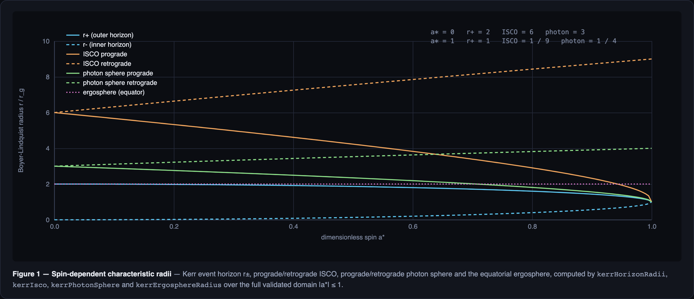
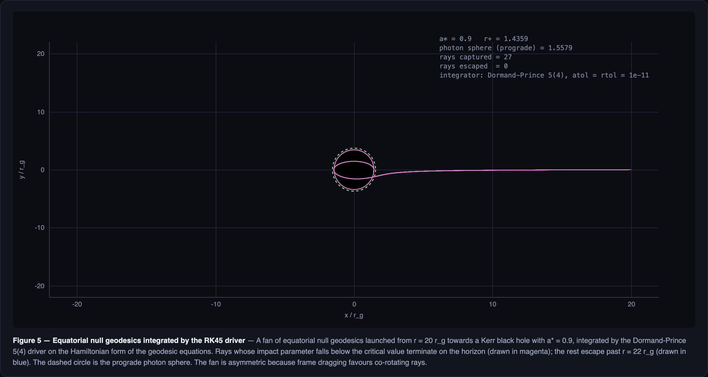
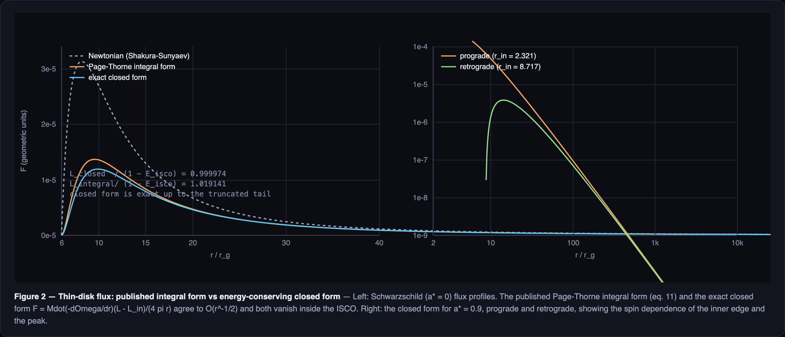
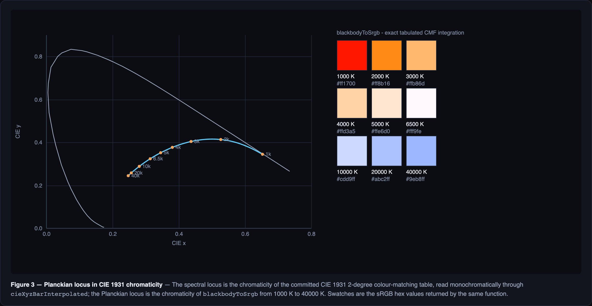
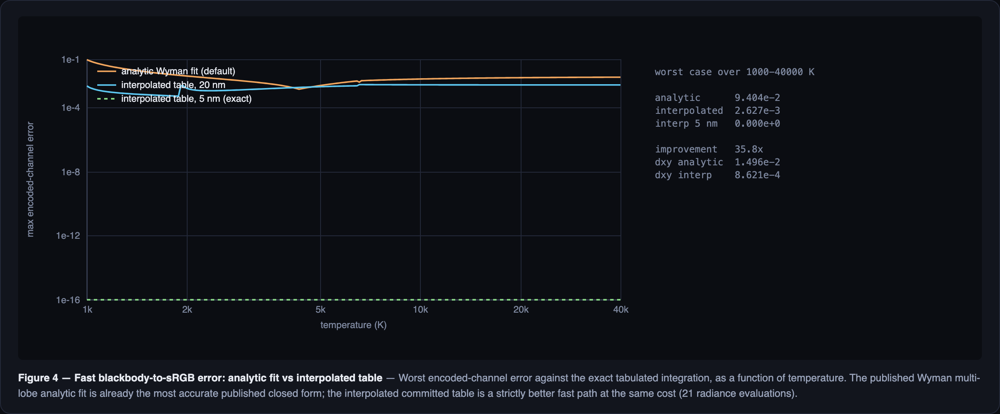

# Kerr ray-tracing physics core

## Purpose

This document specifies the pure, deterministic science core that backs the Kerr
black-hole views: null geodesics in the Kerr exterior, spin-dependent
characteristic radii, thin-disk thermodynamics, relativistic frequency shifts,
and spectral colour conversion.

The core lives in `js/science/` and is importable in Node with no DOM, React,
Three.js, WebGL, or WebGPU dependency. `js/physics.mjs` re-exports the whole
surface; `js/physics.jsx` mirrors it onto `window.QGA_PHYSICS` for the
zero-bundler browser runtime. `test/physics-bridge.test.mjs` evaluates the
browser mirror in a `node:vm` context and asserts value-for-value agreement with
the ESM modules, so the mirror cannot silently drift.

## Module map

| Module | Owns |
| --- | --- |
| `js/science/constants.mjs` | SI constants, geometric-unit conversions, input validation |
| `js/science/kerr.mjs` | Kerr metric, characteristic radii, Carter potentials, conserved quantities, ray tracer |
| `js/science/integrators.mjs` | Fixed-step RK4, adaptive Dormand–Prince 5(4), termination predicates, event refinement |
| `js/science/accretion-disk.mjs` | Kerr circular orbits, Page–Thorne flux, disk temperature, g-factors |
| `js/science/spectrum.mjs` | Planck law, Wien laws, CIE 1931 XYZ integration, sRGB conversion |
| `js/science/data/cie-1931-2deg.mjs` | Committed CIE 1931 2° colour-matching data with provenance |

## Epistemic separation

Every quantity below is tagged with one of four levels. The tag is a claim about
*what kind of statement it is*, not about how confident the implementation is.

- **Exact** — a closed-form result of general relativity, reproduced to floating-point accuracy.
- **Numerical approximation** — a controlled discretisation of an exact integral or ODE, with a stated error behaviour.
- **Display approximation** — a deliberately simplified formula used only for on-screen readouts, never for physics claims.
- **Conjectural interpretation** — a reading of the output that is not itself a result of the equations.

## Units

All internal computation uses geometric units with $G = c = M = 1$. The
Schwarzschild radius is $r_g = 1$, so lengths are in gravitational radii and
times in $r_g/c$. SI conversion is explicit and one-directional through
`js/science/constants.mjs`:

| Conversion | Definition |
| --- | --- |
| `massKilograms(massSolar)` | $M = M_\odot \cdot M_{\text{solar}}$ |
| `geometricLengthUnitMeters(massSolar)` | $GM/c^2$ |
| `geometricTimeUnitSeconds(massSolar)` | $GM/c^3$ |
| `geometricTemperatureUnitKelvin(massSolar)` | $\hbar c^3 / (G M k_B)$ |
| `geometricFluxToSI(flux, massSolar)` | $c^9 / (G^3 M^2)$ |
| `kgPerSecondToGeometricMassRate(rate, massSolar)` | $\dot M_{\text{SI}} \cdot G / (M c)$ |

The temperature unit is the **Hawking scale**, matching the atlas convention that
$T_{\text{geom}} = 1/(8\pi)$ for a Schwarzschild hole. This is a convention
choice, not a physical claim about disk emission; the disk module converts
through the same unit so the two are consistent.

> **Unit trap.** `pageThorneFluxGeometric` takes a *geometric* mass rate. Passing
> an SI rate in kg/s without `kgPerSecondToGeometricMassRate` is wrong by
> $\sim 4 \times 10^{35}$ for a $10\,M_\odot$ hole.

## Kerr geometry

### Metric (exact)

Boyer–Lindquist coordinates $(t, r, \theta, \phi)$ with dimensionless spin
$a_* = a/M \in [-1, 1]$:

$$\Delta = r^2 - 2r + a^2, \qquad \Sigma = r^2 + a^2\cos^2\theta, \qquad A = (r^2+a^2)^2 - a^2\Delta\sin^2\theta$$

Covariant components:

$$g_{tt} = -\left(1 - \frac{2r}{\Sigma}\right), \quad g_{t\phi} = -\frac{2ar\sin^2\theta}{\Sigma}, \quad g_{\phi\phi} = \frac{A\sin^2\theta}{\Sigma}, \quad g_{rr} = \frac{\Sigma}{\Delta}, \quad g_{\theta\theta} = \Sigma$$

Contravariant components:

$$g^{tt} = -\frac{A}{\Sigma\Delta}, \quad g^{t\phi} = -\frac{2ar}{\Sigma\Delta}, \quad g^{\phi\phi} = \frac{\Delta - a^2\sin^2\theta}{\Sigma\Delta\sin^2\theta}, \quad g^{rr} = \frac{\Delta}{\Sigma}, \quad g^{\theta\theta} = \frac{1}{\Sigma}$$

`kerrMetricComponents`, `kerrInverseMetricComponents`, and
`kerrInverseMetricDerivatives` expose these. The derivative form is what the
Hamiltonian integrator consumes; it is analytic, not finite-differenced.

### Characteristic radii (exact)

| Quantity | Formula | Function |
| --- | --- | --- |
| Horizons | $r_\pm = 1 \pm \sqrt{1 - a_*^2}$ | `kerrHorizonRadii` |
| ISCO | Bardeen–Press–Teukolsky $z_1, z_2$ construction | `kerrIsco` |
| Photon sphere | $2\left(1 + \cos\left(\tfrac{2}{3}\arccos(\mp a_*)\right)\right)$ | `kerrPhotonSphere` |
| Ergosphere | $1 + \sqrt{1 - a_*^2\cos^2\theta}$ | `kerrErgosphereRadius` |

`kerrIsco` and `kerrPhotonSphere` take `{ prograde }` and return a **number**.
The prograde branch is the co-rotating one for $a_* \ge 0$ and the
counter-rotating one for $a_* < 0$, so `prograde: true` always means "orbiting
with the hole's spin".

Reference values asserted in `test/kerr.test.mjs`:

| $a_*$ | $r_+$ | $r_-$ | ISCO pro | ISCO retro | photon pro | photon retro |
| --- | --- | --- | --- | --- | --- | --- |
| 0 | 2 | 0 | 6 | 6 | 3 | 3 |
| 0.5 | 1.8660254037844386 | 0.1339745962155614 | 4.233002529530826 | 7.554584714512358 | 2.3472963553338606 | 3.532088886237956 |
| 0.9 | 1.4358898943540672 | 0.5641101056459328 | 2.320883041761887 | 8.717352279606489 | 1.5578546274233829 | 3.910267939103037 |
| 0.998 | 1.0632139225171164 | 0.9367860774828836 | 1.2369706551751847 | 8.99437445480357 | 1.0739092576799516 | 3.998221892847946 |
| 1 | 1 | 1 | 1 | 9 | 1 | 4 |
| −1 | 1 | 1 | 9 | 1 | 4 | 1 |

At extremal spin the closed forms lose precision: `kerrPhotonSphere(1, {prograde: true})`
returns `1.0000000000000004`, not exactly `1`. Tests use tolerances, never exact
equality, on the extremal boundary. No branch produces `NaN`; the
$\arccos$ argument is clamped by construction because $|a_*| \le 1$ is validated
on entry.

*Every curve is a direct call into `kerrHorizonRadii`, `kerrIsco`,
`kerrPhotonSphere`, and `kerrErgosphereRadius` over $a_* \in [0, 1]$ — no
interpolation, no fitted constants. The prograde ISCO collapses to the horizon
at extremality while the retrograde ISCO rises to $9\,r_g$; the two photon
spheres bracket the horizon and meet it at $a_* = 1$.*

### Conserved quantities (exact)

For a null geodesic with 4-momentum $p^\mu$, the three conserved quantities are

$$E = -p_t, \qquad L_z = p_\phi, \qquad Q = p_\theta^2 + \cos^2\theta\left(-a^2E^2 + \frac{L_z^2}{\sin^2\theta}\right)$$

`kerrConservedQuantities({aStar, r, theta, direction, observer})` builds them from
a local direction in either the **ZAMO** frame (default) or the **static** frame.
The static frame throws `RangeError` inside the ergosphere, where no static
observer exists. The ZAMO frame is null by construction: the photon direction is
$p^\mu = e_{\hat t}^\mu + n_{\hat r} e_{\hat r}^\mu + n_{\hat\theta} e_{\hat\theta}^\mu + n_{\hat\phi} e_{\hat\phi}^\mu$
with $u \cdot u = -1$, $n \cdot n = 1$, $u \cdot n = 0$.

### Separated potentials (exact)

$$R(r) = \left[E(r^2+a^2) - aL_z\right]^2 - \Delta\left[(L_z - aE)^2 + Q\right]$$
$$\Theta(\theta) = Q + a^2E^2\cos^2\theta - L_z^2\cot^2\theta$$

`kerrRadialPotential` and `kerrPolarPotential` take an **options object**
(`{aStar, E, Lz, Q, r}` and `{aStar, E, Lz, Q, theta}`), not positional
arguments. The identities verified in the test suite are

$$R(r) = \Delta^2 p_r^2, \qquad \Theta(\theta) = p_\theta^2$$

Note that $R/\Delta = \Theta$ is **not** an identity — the null condition is
$R/\Delta + \Theta = 0$ only after the $t$ and $\phi$ pieces are included. The
implementation integrates the Hamiltonian form directly rather than tracking
$\sqrt{R}$ and $\sqrt{\Theta}$, which avoids the sign bookkeeping at turning
points.

## Ray integration

### Hamiltonian form (exact equations, numerical solution)

The tracer integrates

$$H = \tfrac{1}{2} g^{\mu\nu} p_\mu p_\nu = 0$$

with state $[t, r, \theta, \phi, p_t, p_r, p_\theta, p_\phi]$. Because the metric
is stationary and axisymmetric, $p_t = -E$ and $p_\phi = L_z$ are constants of
the motion and their right-hand sides are identically zero, so $E$ and $L_z$
drift only through floating-point round-off. $Q$ and $H$ are the meaningful
drift diagnostics.

### Steppers

- `rk4Step` — classical fourth-order Runge–Kutta, global error $O(h^4)$.
- `rk45Step` — Dormand–Prince 5(4) with an embedded fourth-order error estimate.
  The returned `errorNorm` is the RMS of $|e_i| / (\text{atol} + \text{rtol}\,|y_i|)$,
  i.e. it is **relative to the tolerance**: a value near 1 means the step sits at
  the tolerance limit, not that the error is 1.

`integrateFixedStep` and `integrateAdaptive` share a driver that enforces:

- **absolute and relative tolerances** (`atol`, `rtol`),
- a **maximum-step guard** (`hMax`; `Infinity` is accepted and means "no ceiling"),
- a **minimum step** (`hMin`) below which the controller stops shrinking,
- a **step budget** (`maxSteps`) that bounds *attempted* steps, so
  `steps + rejected === maxSteps` when the budget is exhausted,
- **non-finite-state rejection** — a step that produces `NaN` or `Infinity` is
  rejected and the run terminates with `status: "non-finite"`.

### Termination

`createRadialTermination` fires on a radius threshold (horizon or escape);
`createPlaneCrossingTermination` fires when $\cos\theta$ changes sign across the
equatorial plane, restricted to an annulus; `combineTerminations` composes them
with first-hit-wins. `traceKerrRay` orders them **horizon → disk → escape**.

### Event refinement (numerical approximation)

A plane crossing detected by a step is only $O(h^2)$ accurate if the reported
state is the post-step state. `runDriver` therefore terminates *at* the event and
`refineEvent` bisects the bracketing fraction (24 iterations, or until the
bracket is narrower than $10^{-12}$) using the predicate itself as the sign
oracle, re-stepping from the pre-event state each time. This is generic: it needs
no predicate-specific knowledge, only that the predicate reports a `fraction` in
$(0, 1)$.

Effect on a representative disk-crossing ray ($a_* = 0.9$, $r = 20$,
$\theta = 1.2$, direction $[-0.9, 0.1, -0.3]$, disk $[2.32, 30]$):

| tolerance | crossing $r$ | $\cos\theta$ | $\Delta Q$ | $\Delta H$ | steps |
| --- | --- | --- | --- | --- | --- |
| $10^{-8}$ | 6.735473809465858 | $6.1\times10^{-17}$ | $1.8\times10^{-8}$ | $3.2\times10^{-9}$ | 19 |
| $10^{-10}$ | 6.735473837566053 | $6.1\times10^{-17}$ | $-4.5\times10^{-11}$ | $7.0\times10^{-11}$ | 30 |
| $10^{-12}$ | 6.7354738383246415 | $6.1\times10^{-17}$ | $-4.4\times10^{-11}$ | $-1.7\times10^{-12}$ | 73 |

Before refinement the same ray reported $\cos\theta \approx -0.00999$ and
$\Delta Q \approx 3\times10^{-3}$ — the drift was dominated by interpolation
error, not integration error. The crossing radius is now converged to eight
significant digits across tolerances. Refinement costs at most 24 extra RK steps
per event, and there is at most one event per ray.

*Twenty-seven equatorial null geodesics at $a_* = 0.9$, launched from
$r = 20\,r_g$ with impact parameters spanning $-8$ to $+8\,r_g$ and integrated by
`integrateAdaptive` with the radial termination predicates. The asymmetry is the
frame dragging: rays with negative impact parameter (co-rotating) are captured
over a much wider band than the counter-rotating ones, and the captured rays
spiral in to the horizon while the escaped rays are deflected and leave the
frame. The dashed circle is the prograde photon sphere at
$r = 1.5579\,r_g$.*

### Drift bounds (measured)

| Ray | steps | $\Delta E$ | $\Delta L_z$ | $\Delta Q$ | $\Delta H$ |
| --- | --- | --- | --- | --- | --- |
| escaped, $a_*=0.9$ | 10512 | 0 | 0 | $8.0\times10^{-10}$ | $8.8\times10^{-12}$ |
| escaped, $a_*=0$ | 10525 | 0 | 0 | $8.2\times10^{-10}$ | $8.7\times10^{-12}$ |
| captured, $a_*=0.9$ | 291 | 0 | 0 | $-8.0\times10^{-11}$ | $-2.2\times10^{-7}$ |
| captured, $a_*=0$ | 239 | 0 | 0 | 0 | $-4.2\times10^{-7}$ |

**The captured-ray Hamiltonian drift is a real numerical limitation, not a bug.**
Near $r_+$ the radial inverse metric $g^{rr} = \Delta/\Sigma$ vanishes while
$g^{rr}$'s contribution to $H$ is amplified by the diverging $p_r$, so the null
constraint degrades as the ray approaches the horizon. The tracer terminates at
$r_+ + \varepsilon$ with `horizonEpsilon` defaulting to $10^{-3}$:

| `horizonEpsilon` | $\Delta H$ (captured, $a_*=0$) | steps |
| --- | --- | --- |
| $10^{-2}$ | $2.4\times10^{-8}$ | 217 |
| $10^{-3}$ | $2.2\times10^{-7}$ | 291 |
| $10^{-4}$ | $2.3\times10^{-6}$ | 365 |
| $10^{-6}$ | $1.2\times10^{-3}$ | 513 |

Tightening `atol`/`rtol` to $10^{-12}$ at $\varepsilon = 10^{-3}$ recovers
$\Delta H \approx 7\times10^{-10}$ at 741 steps. The default trades a bounded
constraint error for a bounded step count; callers that need tighter constraint
satisfaction should tighten the tolerances rather than shrink `horizonEpsilon`.

### Coordinate singularity and Kerr–Schild scope

Boyer–Lindquist coordinates are singular on the horizons ($\Delta = 0$), where
$g_{rr}$ and $g^{rr}$ diverge. **The tracer never crosses the horizon.** A
captured ray terminates at $r_+ + \varepsilon$ and is reported as `captured`;
the implementation makes no claim about the interior, about horizon crossing, or
about the experience of an infalling observer. This is a statement about the
coordinate chart, not about the spacetime: the horizon is a regular surface of
the Kerr geometry, and the divergence is an artefact of the chart.

`boyerLindquistToKerrSchild` provides a **coordinate conversion only**:

$$x + iy = (r + ia)\sin\theta\, e^{i\phi}, \qquad z = r\cos\theta, \qquad t_{\text{KS}} = t_{\text{BL}} + \int \frac{r^2+a^2}{\Delta}\,dr$$

The exterior closed form is

$$t_{\text{KS}} = t_{\text{BL}} + r + \ln|\Delta| + \frac{1}{k}\ln\left|\frac{r-1-k}{r-1+k}\right|, \qquad k = \sqrt{1-a_*^2}$$

with the extremal limit $k \to 0$ giving $r + \ln|\Delta| - 2/(r-1)$. The offset
is defined up to an additive constant (a pure time translation). The function
throws `RangeError` when $\Delta \le 0$. **Scope:** this converts coordinates for
display and cross-checking. It does not make the integrator horizon-penetrating,
it does not change the metric the tracer uses, and no result in this core depends
on it. A Kerr–Schild *integration* would be a separate, larger change.

## Thin accretion disk

### Circular orbits (exact)

`kerrCircularOrbit(aStar, r, { prograde })` returns the specific energy $E$,
specific angular momentum $L$, angular velocity $\Omega$, $\Omega'$, and the
time component $u^t$, all from the standard equatorial circular-orbit
expressions, plus metric-based cross-checks
(`specificEnergyFromMetric`, `specificAngularMomentumFromMetric`). It throws
`RangeError` inside the photon sphere (where no timelike circular orbit exists)
and when the orbit is not timelike.

Verified identities:

- $E - \Omega L = 1/u^t$ (agreement to 12 decimals at $r = 6, 8, 10, 20, 100$).
- Schwarzschild limit: $E = (r-2)/\sqrt{r(r-3)}$, $L = r/\sqrt{r-3}$, $u^t = 1/\sqrt{1-3/r}$.
- At $a_* = 0.9$, $r = 10$: prograde $E = 0.952240238649598$ is **smaller** than
  retrograde $E = 0.9621128192663938$ — prograde orbits are more tightly bound.

### Page–Thorne flux (exact formula, numerical quadrature)

Two flux functions are provided. They are **not** the same function, and the
difference is the subject of this section.

#### The published integral form

`pageThorneFluxGeometric` implements Page & Thorne (1974) equation 11:

$$F(r) = \frac{\dot M}{4\pi r} \cdot \frac{-\mathrm{d}\Omega/\mathrm{d}r}{(E - \Omega L)^2} \int_{r_{\text{in}}}^{r} (E - \Omega L)\frac{\mathrm{d}L}{\mathrm{d}r}\,\mathrm{d}r$$

The inner integral is evaluated with a cached Gauss–Legendre rule
(`gaussLegendreNodes`, default order 64; `gaussLegendreIntegrate`). The flux is
**exactly zero** for $r \le r_{\text{in}}$, and $r_{\text{in}}$ defaults to the
ISCO for the requested spin and orientation.

**This is a model, and it is labeled as one.** It assumes a geometrically thin,
optically thick disk in the equatorial plane, steady accretion, zero torque at
the inner edge, and local blackbody emission. It does not include disk thickness,
radiative transfer, returning radiation, or magnetic stresses.

#### The energy-conserving closed form (exact)

`pageThorneFluxClosedFormGeometric` implements the closed form

$$F(r) = \frac{\dot M\,(-\mathrm{d}\Omega/\mathrm{d}r)\,\bigl(L(r) - L(r_{\text{in}})\bigr)}{4\pi r}$$

which is the same physics with the radial integral already performed. It is
**exact** in the sense that it integrates to the accreted binding energy with no
residual.

**Derivation.** Angular-momentum balance for the annulus $[r, r+\mathrm{d}r]$
gives $\mathcal{W}' = \dot M L'$, so the outward torque is
$\mathcal{W} = \dot M\,(L - L_i) > 0$. Energy balance for the same annulus gives

$$\dot M E' - (\Omega \mathcal{W})' = 4\pi r F .$$

The work term enters with a **minus**: the annulus loses angular momentum to the
outside (which does negative work on it) and gains it from the inside.
Substituting the exact circular-orbit first law $E' = \Omega L'$ and
$\mathcal{W}' = \dot M L'$:

$$4\pi r F = \dot M \Omega L' - \Omega' \dot M (L - L_i) - \Omega \dot M L' = -\dot M \Omega' (L - L_i).$$

Equivalently, the dissipation rate per unit area is
$D = \mathcal{W}(-\Omega')/(4\pi r)$ — torque times shear rate, the classic
Shakura–Sunyaev / Lynden-Bell–Pringle result.

**The plus-sign variant is disproven.** $\dot M E' + (\Omega\mathcal{W})' = 4\pi rF$
gives $4\pi rF = \dot M r^{-2}\bigl[\tfrac32\sqrt{r_i/r} - \tfrac12\bigr]$, which is
**negative** for large $r$.

**Newtonian cross-check.** $4\pi rF = \dot M E' - (\Omega\mathcal{W})' = \tfrac{3\dot M}{2r^2}\bigl(1 - \sqrt{r_i/r}\bigr)$,
so $F = \tfrac{3\dot M}{8\pi r^3}\bigl(1 - \sqrt{r_i/r}\bigr)$ — the standard
Shakura–Sunyaev flux, integrating to $\dot M/(2r_i) = \dot M/12$ for $r_i = 6$.

**Exact-integration proof.** Integrating by parts with $u = L - L_i$,
$\mathrm{d}v = -\Omega'\,\mathrm{d}r$ (so $v = -\Omega$):

$$\int_{r_i}^{\infty} 4\pi rF\,\mathrm{d}r = \dot M \int_{r_i}^{\infty} \Omega L'\,\mathrm{d}r = \dot M \int_{L_i}^{L_\infty} \Omega\,\mathrm{d}L = \dot M \int_{E_i}^{E_\infty} \mathrm{d}E = \dot M\,(1 - E_i),$$

using $\mathrm{d}E = \Omega\,\mathrm{d}L$, $\Omega \to 0$ at infinity, and
$L = L_i$ at $r_i$.

**Reduction to the textbook Schwarzschild closed form.** For $a_* = 0$ the
expression above becomes

$$F(r) = \frac{3}{8\pi r^3}\left[\left(1 - \frac{3}{r}\right)^{-1/2} - \sqrt{\frac{r_i}{r}}\left(1 - \frac{3}{r_i}\right)^{-1/2}\right],$$

which for $r_i = 6$ is $\tfrac{3}{8\pi r^3}\bigl[(1-3/r)^{-1/2} - \sqrt{12/r}\bigr]$.
The module reproduces this to $10^{-16}$ relative at $r = 7, 10, 20, 100, 1000$.

#### Why the two forms differ (the ~2% residual, resolved)

The identity that would make the integral form equal the closed form,

$$\int_{r_i}^{r} (E - \Omega L) L'\,\mathrm{d}r \stackrel{?}{=} (E - \Omega L)^2 (L - L_i),$$

**does not hold.** Measured ratio of the two sides: 1.295 at $r = 7$, 1.222 at
$r = 8$, 1.139 at $r = 10$, 1.021 at $r = 20$, 0.975 at $r = 100$ — converging to 1
only as $r \to \infty$. Analytically,
$\frac{\mathrm{d}}{\mathrm{d}r}\bigl[(E-\Omega L)^2(L-L_i)\bigr] = (E-\Omega L)\bigl[-2\Omega' L (L-L_i) + (E-\Omega L)L'\bigr]$
while the integrand is $(E-\Omega L)L'$; the two differ unless
$\Omega' L (L - L_i) = 0$.

So the published integral form carries an intrinsic $O(r^{-1/2})$ error, and the
closed form does not. Measured luminosity for $a_* = 0$, $r_{\text{in}} = 6$,
$r_{\text{out}} = 10^6$:

| Quantity | Value | Ratio to $1 - E_{\text{ISCO}}$ |
| --- | --- | --- |
| $1 - E_{\text{ISCO}}$ (exact) | 0.057190958417936755 | 1 |
| `diskLuminosityGeometric({ form: "closed-form" })` | 0.05718946188091324 | **0.999974** |
| `diskLuminosityGeometric({ form: "integral" })` | 0.05828566139984335 | 1.019141 |

The closed form's 2.6e-5 shortfall is **exactly the truncated tail**:
$\int_{10^6}^{\infty} \tfrac{3}{2r^2}\,\mathrm{d}r = \tfrac{3}{2 \cdot 10^6} = 1.5\times10^{-6}$,
and $1.5\times10^{-6} / 0.0572 = 2.6\times10^{-5}$. With the outer limit pushed to
$10^5$ the shortfall is $1.5\times10^{-5}$, again matching to the digit.

Candidate closed forms were tested against the exact target with the
coordinate-area luminosity integral:

| Candidate | Value | Ratio |
| --- | --- | --- |
| $-\Omega'(L-L_i)/(4\pi r)$ | 0.057176067850 | **0.999740** |
| $-\Omega'(L-L_i)/(4\pi r E)$ | 0.058238973459 | 1.018325 |
| $-\Omega'(L-L_i)/(4\pi r (E-\Omega L))$ | 0.061160536203 | 1.069409 |
| $-\Omega'(L-L_i)/(4\pi r (E-\Omega L)^2)$ | 0.065665059916 | 1.148172 |
| published integral form | 0.058272124299 | 1.018904 |
| $-\Omega'(L-L_i)/(4\pi r\,u^t)$ | 0.053635568694 | 0.937833 |

The first row is the implemented closed form. (The proper-area element
$\sqrt{g_{rr}g_{\varphi\varphi}} = \sqrt{A/\Delta}$ makes every candidate *worse* —
the closed form's ratio becomes 1.043 — so the coordinate-area measure is the
right one.)

**Both functions are kept.** `pageThorneFluxGeometric` is retained verbatim so
the module can be checked against published values; `pageThorneFluxClosedFormGeometric`
is the physically exact alternative and is the default for
`diskLuminosityGeometric`. The test suite asserts the closed form's luminosity
identity to $10^{-5}$ relative and the integral form's to 2%.

The Newtonian-limit convergence test still applies to the integral form:
$F_{\text{PT}}/F_N \to 1$ monotonically as $r \to \infty$ (ratio 0.954 at
$r = 1000$, 0.979 at $r = 5000$; error $\approx 9.4/r$). The closed form converges
faster: 0.886 at $r = 100$, 0.967 at $r = 1000$, 0.990 at $r = 10^4$, 0.997 at
$r = 10^5$.

### Disk temperature (exact given the flux)

$$T_{\text{eff}} = \left(\frac{F}{\sigma_{\text{geom}}}\right)^{1/4}, \qquad \sigma_{\text{geom}} = \frac{\pi^2 \hbar c}{60\,G M^2}$$

with $M$ in **kilograms**. Requiring $F = \sigma T^4$ in both unit systems fixes
this constant uniquely given the conversion factors above. Verified identity:
$\sigma_{\text{SI}} T_{\text{SI}}^4 = \texttt{geometricFluxToSI}(F_{\text{geom}}, M)$
to $1.9\times10^{-9}$ relative (limited by SI constant precision).

For $10\,M_\odot$ at $\dot M = 10^{18}$ g/s: $T_* = 7.961\times10^6$ K, the
Page–Thorne peak is $3.158\times10^6$ K at $r = 9.551$, and the Newtonian peak is
$1.480\times10^6$ K at $r = 49/6\,r_g$. The textbook ratio
$T_{\max,N}/T_* = 0.488$ is reproduced.

At fixed **SI** accretion rate, $T \propto (\dot M / M^2)^{1/4} = \dot M^{1/4} M^{-1/2}$.
The familiar $M^{-1/4}$ scaling applies at fixed Eddington ratio, where
$\dot M \propto M$.

### Frequency shifts (exact, no double counting)

The total shift factorises exactly:

$$g_{\text{total}} = g_{\text{grav}} \cdot g_{\text{orb}}, \qquad g_{\text{grav}} = \frac{1}{u^t}, \qquad g_{\text{orb}} = \frac{E}{E - \Omega L_z} = \frac{1}{1 - \Omega b}$$

where $b = L_z/E$ is the photon impact parameter. `kerrTotalRedshiftFactor`
returns all three and the test suite asserts
`total === gravitational * orbital` to machine precision, so the two effects are
never counted twice.

`kerrGravitationalRedshiftStatic(aStar, r) = \sqrt{-g_{tt}}$ is a **distinct**
quantity: it describes a *static* emitter with no orbital motion, and is
undefined inside the ergosphere. It is not a component of the orbiting
decomposition and must not be multiplied into it.

`observedTemperatureKelvin(emittedKelvin, g)` applies the shift to a temperature.
A zero emitted temperature is legitimate and returns zero; a non-positive $g$ is
rejected.

## Spectral colour conversion

### Planck law (exact)

$$B_\lambda(\lambda, T) = \frac{2hc^2}{\lambda^5}\frac{1}{e^{hc/(\lambda k_B T)} - 1}, \qquad B_\nu(\nu, T) = \frac{2h\nu^3}{c^2}\frac{1}{e^{h\nu/(k_B T)} - 1}$$

`planckSpectralRadiance` returns 0 when the exponent exceeds 700, avoiding
overflow without changing the result at any representable temperature.

Wien's displacement law is implemented in both forms, and the test suite checks
each against the numerically located peak of the corresponding Planck function:

$$b_\lambda = 2.897771955\times10^{-3}\ \text{m}\cdot\text{K}, \qquad \frac{\nu_{\max}}{T} = 2.8214393721220787\,\frac{k_B}{h}$$

The Stefan–Boltzmann check is $\pi \int B_\lambda\,\mathrm{d}\lambda = \sigma T^4$;
the factor of $\pi$ is the solid-angle integral and is essential.

### CIE 1931 XYZ (exact data, numerical integration)

`js/science/data/cie-1931-2deg.mjs` commits the CIE 1931 2° standard observer
colour-matching functions at 5 nm spacing from 380 nm to 780 nm (81 samples),
with a provenance object recording the source, distributor, URL, and licence.
The data was generated programmatically from the CVRL `ciexyz31_1` table rather
than transcribed, and the long-wavelength tail was re-verified against the raw
CSV.

`cieXyzFromSpectralRadiance(radiance)` integrates the committed table by the
trapezoid rule (endpoints weighted 0.5) and returns **unnormalised** XYZ.
`cieXyzBarTabulated(index)` exposes the raw table.

*The spectral locus is the chromaticity of the committed colour-matching table,
read monochromatically through `cieXyzBarInterpolated` — the locus is by
definition the chromaticity of a single wavelength, so no integration is
involved. The Planckian locus is the chromaticity returned by `blackbodyToSrgb`
from 1000 K to 40000 K, and the swatches are the sRGB hex values from the same
function. The locus is drawn from the data, not from the analytic fit.*

### Analytic CMF fit (numerical approximation)

`cieXyzBarAnalytic` implements the Wyman, Sloan & Shirley (2013) piecewise-Gaussian
fit to the colour-matching functions. It is used only by the fast path. Its worst
absolute deviation from the committed table is 0.0238 at 425 nm ($\bar z$).

### sRGB conversion (exact matrix, exact transfer function)

`XYZ_TO_LINEAR_SRGB` is the D65 matrix from IEC 61966-2-1 / Lindbloom.
`linearSrgbToSrgb` and `srgbToLinearSrgb` implement the IEC 61966-2-1 transfer
function (threshold 0.0031308, slope 12.92, offset 0.055, exponent 1/2.4).
`linearSrgbToHex` clamps to $[0,1]$ before encoding.

`blackbodyToSrgb(T)` normalises XYZ to $Y = 1$, converts to linear sRGB,
normalises so the brightest channel is 1 (clamping negatives to 0), and
gamma-encodes. Reference values asserted in the test suite:

| $T$ (K) | hex | CIE $x$ | CIE $y$ |
| --- | --- | --- | --- |
| 1000 | `#ff1700` | 0.6527 | 0.3445 |
| 2000 | `#ff8b16` | 0.5267 | 0.4133 |
| 3000 | `#ffb86d` | 0.4369 | 0.4041 |
| 4000 | `#ffd3a5` | 0.3805 | 0.3768 |
| 5000 | `#ffe6d0` | 0.3451 | 0.3517 |
| 6500 | `#fff9fe` | 0.3136 | 0.3237 |
| 10000 | `#cdd9ff` | 0.2807 | 0.2884 |
| 20000 | `#abc2ff` | 0.2565 | 0.2578 |
| 40000 | `#9eb8ff` | 0.2472 | 0.2449 |

The 6500 K chromaticity sits near the D65 white point (0.3127, 0.3290), as it
must.

### Fast fitted path (display approximation)

`fastBlackbodyToSrgb(T, { stepNm, method })` uses a coarse grid (default 20 nm)
instead of the committed table. It is a **display approximation** for
interactive use, not a colorimetric reference. Two colour-matching sources are
selectable through `method` (`FAST_FIT_METHODS`):

| `method` | Colour-matching source | Worst encoded error, 1000–40000 K |
| --- | --- | --- |
| `"analytic"` (default) | `cieXyzBarAnalytic` — the Wyman/Sloan/Shirley multi-lobe fit | 0.09404 |
| `"interpolated"` | `cieXyzBarInterpolated` — linear interpolation of the committed table | **0.002627** |

`fastBlackbodyToSrgbMaxError` quantifies the deviation over a temperature range
with a deterministic log-uniform scan, reporting three metrics because they
answer different questions:

| Metric | Meaning |
| --- | --- |
| `maxChannelError` | worst error in the gamma-encoded sRGB channel — the worst *display* error |
| `maxLinearChannelError` | worst error in linear sRGB — the worst *physical radiance* error |
| `maxChromaticityError` | worst CIE 1931 $xy$ distance — the standard colorimetric measure |

Measured for the default `method: "analytic"`:

| Range | `maxChannelError` | `maxLinearChannelError` | `maxChromaticityError` |
| --- | --- | --- | --- |
| 1000–40000 K | 0.09404 | 0.01993 | 0.01496 |
| 1500–40000 K | 0.01676 | 0.01206 | 0.00618 |
| 2000–40000 K | 0.00898 | 0.01033 | 0.00334 |

The worst case is at 1000 K, where the reference is
`{r: 1, g: 0.09085, b: 0}` and the fast fit gives `{r: 1, g: 0.18489, b: 0}`.
**The error is dominated by the published Wyman fit's red tail, not by the
integration grid** — steps of 5, 10, 20, and 25 nm all give $\approx 0.094$.

#### The interpolated alternative (36× more accurate)

`cieXyzBarAnalytic` is **already the most accurate published analytic fit** of
the CIE 1931 2° observer. This was verified against the official JCGT
supplement: the paper's `multiLobeFit1931.cpp` (its Equation 4) has reciprocal
widths $1/0.0264 = 37.88$, $1/0.0324 = 30.96$, $1/0.0624 = 16.03$, … which are
exactly the coefficients in the module. The paper's *other* fit
(`oneGaussianPerLobe1931.cpp`) is less accurate. So no better published fit
exists, and the 0.094 error is intrinsic to the analytic approach.

The alternative is to interpolate the committed table instead of fitting it.
`cieXyzBarInterpolated(λ_nm)` linearly interpolates the 81 committed samples
(exact at every knot, clamped outside 380–780 nm), and
`cieXyzFromSpectralRadianceInterpolated` integrates it on the same coarse grid.
Measured over 1000–40000 K with 400 log-uniform samples:

| `stepNm` | `maxChannelError` | `maxChromaticityError` |
| --- | --- | --- |
| 5 | **0** (exactly) | **0** (exactly) |
| 10 | 0.000774 | 0.000155 |
| 20 (default) | 0.002627 | 0.000862 |
| 25 | 0.006222 | 0.002123 |

At `stepNm = 20` the interpolated path is **36× more accurate** than the
analytic fit (0.002627 vs 0.09404) and 17× better in chromaticity
(0.000862 vs 0.01496), at the same cost — 21 radiance evaluations. At
`stepNm = 5` the knots coincide with the table and the result is **bit-identical**
to the tabulated path (relative error exactly 0). `stepNm = 25` is worse, so
20 nm is the sweet spot.

**Linear interpolation is the right choice.** Catmull–Rom was measured and gives
*identical* errors at multiples of 5 nm — the error is dominated by the 5 nm
table's own sampling, not by the interpolation order. Catmull–Rom only helps at
off-grid steps (7 nm: 0.0000955 vs 0.000552) and is not worth the boundary
special-casing.

The default remains `method: "analytic"` for backward compatibility. Callers
that want the accuracy should pass `method: "interpolated"`; callers that need
better than ~0.003 encoded error should use `blackbodyToSrgb` or restrict the
range to $\ge 2000$ K.

## Validation contract

Every public entry point validates its inputs and throws a descriptive
`RangeError` or `TypeError` naming the offending parameter and the received
value. Numeric strings are coerced (`kerrHorizonRadii("0.5")` succeeds);
non-numeric strings throw `TypeError`. Deliberate leniencies, asserted in the
tests so they cannot change silently:

- `kerrIsco` / `kerrPhotonSphere` coerce `prograde` with `Boolean(...)`, so
  `{ prograde: "yes" }` behaves as `true` rather than throwing.
- `observedTemperatureKelvin(0, g)` returns 0; a zero emitted temperature is
  physically meaningful.
- `integrateAdaptive` accepts `hMax: Infinity` (no ceiling).

## Determinism

Every function in the core is pure: no clock, no randomness, no I/O, no global
mutable state beyond the Gauss–Legendre node cache (which is keyed by order and
returns frozen arrays). `test/physics-bridge.test.mjs` re-evaluates the browser
mirror in a fresh context and asserts identical results, and the integrator tests
assert that repeated runs and repeated calls with the same inputs produce
bit-identical output and do not mutate their arguments.

## Verification

- `npm test` — 271 tests, including 138 new science tests and 14 browser-bridge
  parity tests.
- `npm run validate` — repository validation.
- `node scripts/benchmark-kerr.mjs` — reports ray count, median integration time,
  convergence error, and conserved-quantity drift. It prints measurements and
  **enforces no machine-specific timing threshold**.
- `node scripts/generate-science-figures.mjs` — regenerates every figure in this
  document from the modules themselves. It serves the worktree over loopback
  HTTP, imports the real `js/science/*.mjs` modules in a headless Chromium page,
  draws each figure to a canvas, and screenshots the `<figure>` element at
  `deviceScaleFactor: 2`. `--check` renders without writing. The script fails
  loudly on any page error or console error, so a figure can never silently
  regress to a blank canvas.

  The `canvas` rule in the figure page declares `background: #0b0d12` in
  addition to painting that colour into the bitmap. This is not cosmetic: the
  element-screenshot path composites the canvas region against the page
  default when the element has no opaque background of its own, which produced
  entirely white figures even though the live canvas was correctly painted.
  Declaring the background in CSS makes the capture path independent of the
  compositor's treatment of the backing store.

## References

1. B. Carter, "Global Structure of the Kerr Family of Gravitational Fields,"
   *Phys. Rev.* **174**, 1559 (1968). [doi:10.1103/PhysRev.174.1559](https://doi.org/10.1103/PhysRev.174.1559)
2. J. M. Bardeen, W. H. Press, S. A. Teukolsky, "Rotating Black Holes: Locally
   Nonrotating Frames, Energy Extraction, and Scalar Synchrotron Radiation,"
   *Astrophys. J.* **178**, 347 (1972). [doi:10.1086/151796](https://doi.org/10.1086/151796)
3. D. N. Page, K. S. Thorne, "Disk-Accretion onto a Black Hole. Time-Averaged
   Structure of Accretion Disks," *Astrophys. J.* **191**, 499 (1974).
   [doi:10.1086/152990](https://doi.org/10.1086/152990)
4. J.-P. Luminet, "Image of a spherical black hole with thin accretion disk,"
   *Astron. Astrophys.* **75**, 228 (1979).
   [ADS:1979A&A....75..228L](https://ui.adsabs.harvard.edu/abs/1979A%26A....75..228L/abstract)
5. O. James, E. von Tunzelmann, P. Franklin, K. S. Thorne, "Gravitational lensing
   by spinning black holes in astrophysics, and in the movie *Interstellar*,"
   *Class. Quantum Grav.* **32**, 065001 (2015).
   [arXiv:1502.03808](https://arxiv.org/abs/1502.03808) ·
   [doi:10.1088/0264-9381/32/6/065001](https://doi.org/10.1088/0264-9381/32/6/065001)
6. J.-P. Bruneton, "A new method for simulating light propagation in the
   Kerr spacetime" (2020). [arXiv:2010.13628](https://arxiv.org/abs/2010.13628)
7. C. Wyman, P.-P. Sloan, P. Shirley, "Simple Analytic Approximations to the CIE
   XYZ Color Matching Functions," *J. Comput. Graph. Tech.* **2**, 1 (2013).
8. CIE, *Colorimetry*, CIE 15:2004 / CIE 018:2019, and the CVRL colour-matching
   function database, <http://cvrl.ioo.ucl.ac.uk/>.
9. IEC 61966-2-1:1999, *Multimedia systems and equipment — Colour measurement and
   management — Part 2-1: Default RGB colour space — sRGB*.

## Conjectural interpretation

The core computes where photons go and what colour they would carry. Any
statement that a rendered image *is* what an observer would see is a
**conjectural interpretation** layered on top: it assumes a camera position, a
spectral response, a display gamut, and a tone mapping, none of which are
properties of the spacetime. The atlas labels such panels accordingly. The
equations above are exact; the picture is a reading of them.
